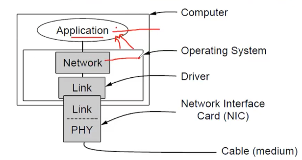

# Lecture 11

| Video Lecture | Password |
|--|--|
| [Lecture link](https://nirmauni.webex.com/nirmauni/ldr.php?RCID=7efe014467e7ba9eca538435453a9b3b) | `sJG7P7RG` |
---

- Elementary data link  protocols
	1. Utopian Simplex Protocol
	2. Simplex Stop-and-Wait protocol 
		> Simplex means one way communication
		- Error-Free Channel
			> there will no mistake in this protocol
	3. Simplex Stop-and-Wait protocol
		- Noisy Channel
			> there can be error in this
	
			
		- NIC is a LAN card *[it's a Hardware]*
		- Only NIC is deals with Physical layer always.
		- **Firmware** : It's a specific class of computer software that provides the low-level control for a device's specific hardware.
		- Code running in hardware will be fast compared to software code execution.
		- CRC and checksum like things done in hardware so that it can done very fast as these are done very frequently! 		*[Error detection and correction part is done at hardware]*
		- The PHY process and some of the data link layer process run on dedicate hardware called a NIC
		- The rest of the link layer process and the network layer process run on the main CPU as part of the OS, with the software for the link layer process often taking the form of a device driver
		- Driver is a piece of software
		
- Key Assumptions : 
	- Machine A wants to send a long stream of data to machine B, using a reliable, connection-oriented service
	- A is assumed to have an infinite supply of data ready to send and never has to wait for data to be produced
	- Machines do not crash

- First protocol is coded in C language.
- Protocol.h file contains all required variables so it will be included in every protocol's file.

- **Protocol.h file :**
	- Some definitions needed in the protocols to follow. These definitions are located in the file protocol.h.
	
	```c
	#define MAX_PKT 1024                    /* packet size in bytes */
	
	typedef enum { false, true } boolean;   /* boolean type */
	typedef unsigned int seq_nr;            /* sequence or ACK numbers */
	
	typedef struct {
	unsigned char data[MAX_PKT];
	} packet;                               /* packet definition (Payload field) */
	typedef enum { data, ack, nak } frame_kind; /* frame kind definition (Three types of frames : data frame {sender sends to receiver}; ACK frame {receiver sends positive ACKs to sender}; NAKs {receiver sends negative ACKs to sender}) */
	
	
	typedef struct {
	frame_kind kind;                    /* what kind of frame? */
	seq_nr seq;                         /* sequence number (of data frame)*/
	seq_nr ack;                         /* ACK number */
	packet info;                        /* the Network layer packet (Payload field) */
	} frame;
	
	/* final packet block : [kind | seq | ack | info]*/
	
	/* wait for an event to happen; return its type of event  (event can be like packet arrival, packet loss etc.)*/
	void wait_for_event(event_type *event);
	
	/* fetch a packet from the network layer for transmission */
	void from_network_layer(packet *p);		//(take something from network layer)
	
	/* deliver information from an inbound frame to the network layer (this functions needs on receiver side)*/
	void to_network_layer(packet *p); //(give something to network layer)
	
	/* get an inbound frame from the physical layer (receiver side)*/
	void from_physical_layer(frame *r);
	
	/* pass the frame to the physical layer */
	void to_physical_layer(frame *s);
	
	/* start the clock and enable the timeout event */
	void start_timer(seq_nr k);		// (for every frame we have to start timer || SENDER SIDE)
	
	/* stop the clock and disable the timeout event */
	void stop_timer(seq_nr k);		// (if ack is received before timer interval so we can stop timer. || SENDER SIDE)
	
	/* start an auxiliary timer and enable the ack_timeout event */
	void start_ack_timer(seq_nr k);		// (of less time interval then above timer. || RECEIVER SIDE || Acks generating time)
	
	/* stop an auxiliary timer and disable the ack_timeout event */
	void stop_ack_timer(seq_nr k);		// (RECEIVER SIDE)
	
	/* allow the network to cause a network_layer_ready event */
	void enable_network_layer(void);
	
	/* forbid the network to cause a network_layer_ready event */
	void disable_network_layer(void);
	
	/* macro inc */
	#define inc(k) if (k < MAX_SEQ) k = k + 1; else k = 0
	```
	
- **Piggybacking** : The receiver waits until its network layer passes in the next data packet. The delayed acknowledgment is then attached to this outgoing data frame. This technique of temporarily delaying the acknowledgment so that it can be hooked with next outgoing data frame is known as piggybacking