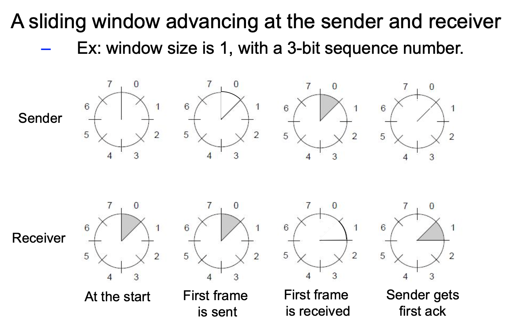
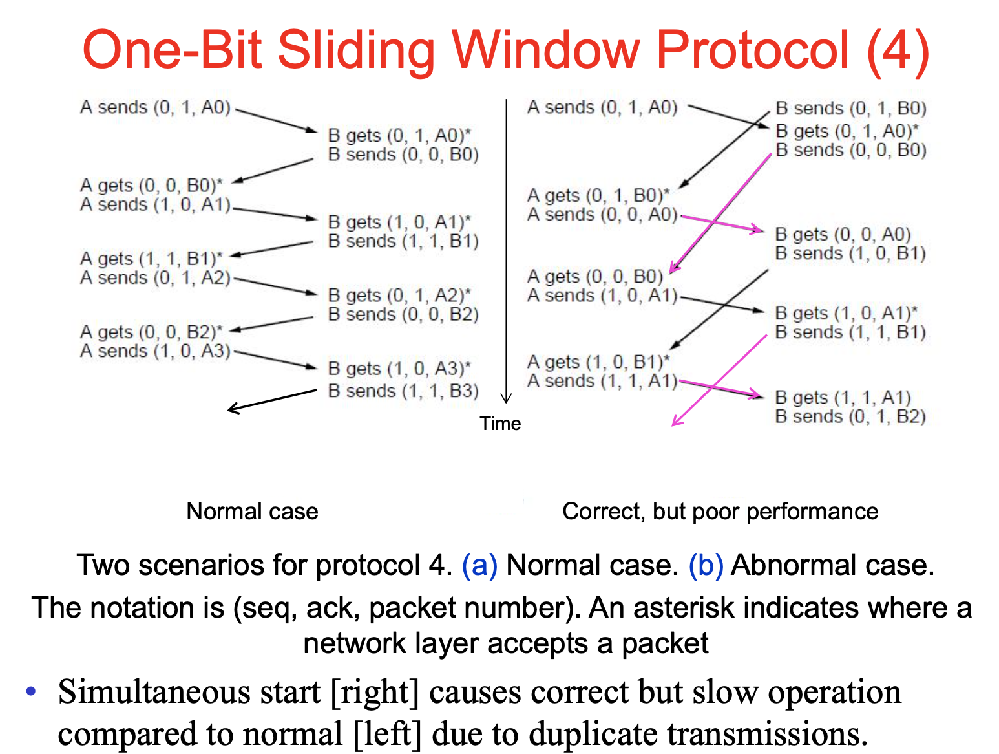

# Lecture 13

|Watch Video Lecture|
|---|
|[youtube link](https://youtu.be/akWmzFC7Ij4)|

---

- All protocols upto now were **SIMPLEX PROTOCOLS**

- ## Sliding Window Protocol
	- Assuming duplex communication, both sides transmits to each other
	- When machine A sends to data to B, it also hooks up the acknowledgement to be sent to B with data packet. It is called as piggybacking
		- simple EXPLANATION : 
			- When there are two computers A and B, both wants to send some data to each other.
			- Let first computer A sends data to computer B and now computer B have to send ACK back to B also computer B wants to send another data to A.
			- So, computer B will add ACK with to header of data which it wants to send to computer A. so both task will be completed on single frame.
			- If we have `SEQUENCE NUMBER` and `ACK` number together then it is called **PIGGYBACKING**
			- Almost every protocols supports PIGGYBACKING. 
			- ACK should be of one bit.
			- Overhead can be reduced through this.
		
		- Immediately upon processing the frame we can generate ACK.
		- We can delay ACK for sometime in order to perform piggybacking  but if the receiver doesn't have to send the data or it delays more..., then receiver has to send the ACK. It cannot delay more.
		
		
	- Wait for some time before sending ack so that if data frame generated can be sent with ack
	- How long to wait? If too long other side will timeout and retransmit and too short *(of receiver side)* , leads to overhead of sending separate ack and data

		- Sender time should be : ( Transmission Time ) Round Trip Time + some constant value *(for processing the frame at receiver side)* : Ts = RTT + C
		- Ta (ACK timer) < Ts - RTT
	
|How sliding window works|
|---|
||

- When window slides ?
	- as ACK is received for **SENDER**
	- as FRAME is received and ACK is generated (After processing the frame) for **RECEIVER**
	
- ## One-Bit Sliding Window (1)

	- Transfers data in both directions with stop-and-wait
		- Piggybacks ACKs on reverse data frames for efficiency
		- Handles transmission errors, flow control, early times
			> **EARLY TIMES** : If sender receivese ACK before timer expires, then we have to stop the timer.
			
			> No sender and receiver different functions
	
	- Here we are not using *ACK timer* in protocol 4
	> We are assuming that receiver is always ready with the data to be send with ACK (piggybacking). and no delay.
			
	```c
	/* Protocol 4 (Sliding window) is bidirectional. */
    #define MAX SEQ 1 /* must be 1 for protocol 4 */

    typedef enum {frame arrival, cksum err, timeout} event type;
    #include "protocol.h"

    void protocol4 (void)
    {
        seq_nr next_frame_to_send; /* 0 or 1 only */		//for sender
        seq_nr frame_expected; /* 0 or 1 only */		//for receiver
        frame r, s; /* scratch variables */			//r for receiver; s for sender
        packet buffer; /* current packet being sent */
        event_type event;

        next_frame_to_send = 0; /* next frame on the outbound stream */
        frame_expected = 0; /* frame expected next */
        from_network_layer(&buffer); /* fetch a packet from the network layer */
        s.info = buffer; /* prepare to send the initial frame */
        s.seq = next_frame_to_send; /* insert sequence number into frame */
        s.ack = 1 − frame_expected; /* piggybacked ack */
        to_physical_layer(&s); /* transmit the frame */
        start_timer(s.seq); /* start the timer running */		// RETRANSMISSION TIMER

        while (true) {
            wait_for_event(&event); /* frame arrival, cksum err, or timeout */
            if (event == frame_arrival) { /* a frame has arrived undamaged */

                from_physical_layer(&r); /* go get it */

                if (r.seq == frame_expected) { /* handle inbound frame stream */		//RECEIVER side
                    to_network_layer(&r.info); /* pass packet to network layer */
                    inc(frame_expected); /* invert seq number expected next */
                }

                if (r.ack == next_frame_to_send) { /* handle outbound frame stream */		//SENDER side
                    stop_timer(r.ack); /* turn the timer off */
                    from_network_layer(&buffer); /* fetch new pkt from network layer */
                    inc(next_frame_to_send); /* invert sender’s sequence number */
                }
            }
            s.info = buffer; /* construct outbound frame */
            s.seq = next_frame_to_send; /* insert sequence number into it */
            s.ack = 1 − frame_expected; /* seq number of last received frame */		//ACK of previous frame
            to_physical_layer(&s); /* transmit a frame */
            start_timer(s.seq); /* start the timer running */
        }
    }
	```
	
	- Here checksum error is not handled explicitly. Here we will simply discard the sender will send that frame again.

- Under stand nomenclature here : 
	- `Sequence Number | ACK | Data/Packet Number/Payload/Info field`
	- `*` means frame is correctly received. which means correctly processed and sent to network layer.
	- Here second case is when B sends packet before it receives packet from A.
		- so A retransmits the A0 packet again with ACK of received B0.
		- This retransmitted frame A0 will be discarded at receiver end of B. as it is processed and already sent to network layer of B.
		- Slightly out of sync can cause this inefficient performance.
		
| Working |
|---|
||