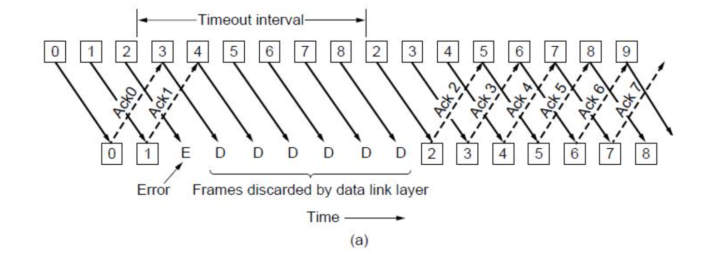
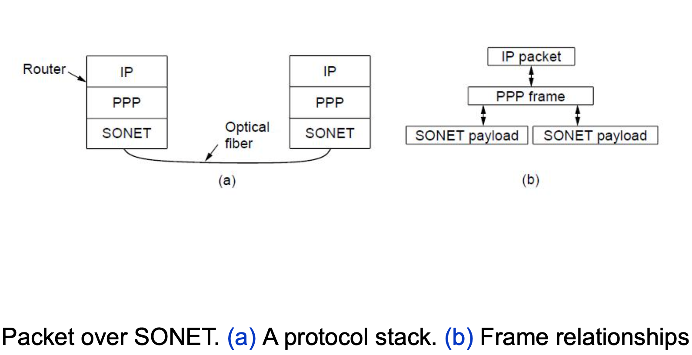
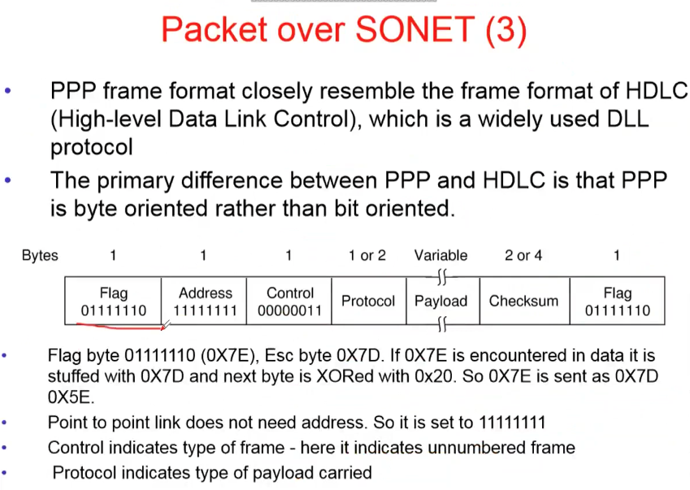
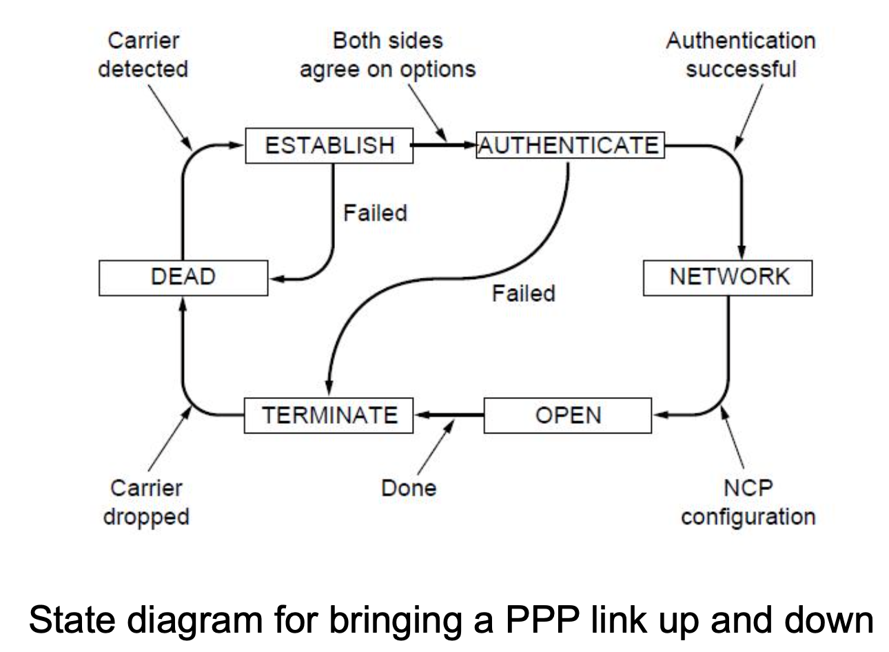
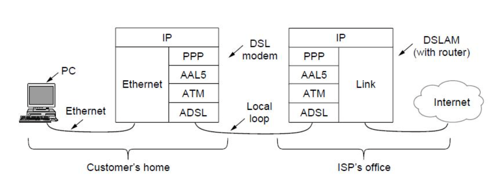

# Lecture 14 & 15

|Watch Video Lecture|
|---|
|[youtube link](https://youtu.be/sfyjZ-2U-TU)|

- There were some Problems with Protocol 4 which wee will see through below example

- ## Numerical  
	- Consider a `50-kbps` satellite channel with a 500-msec round-trip propagation delay. Let us imagine trying to use protocol 4 to send 1000- bit frames via the satellite. At t = 0 the sender starts sending the first frame. At t = 20 msec the frame has been completely sent. Not until t = 270 msec has the frame fully arrived at the receiver, and not until t = 520 msec has the acknowledgement arrived back at the sender, under the best of circumstances
	
	- Transmission Time (Tx) = Frame size / Bandwidth or DataRate
		> Time required to place a frame in wire
		- 1000/50x10^3 = 1/50 = 20ms
		- Bandwidth : 50 kbps
		- Here : 
			- t0:0		> Frame generation started
			- t1:20		> Frame sent on wire
			- t2:270	> Frame received by receiver
			- t3:520	> ACK received by sender
		- Assuming ACK generation-transmission / Processing time is ZERO  
			- Here next frame will start sending at 540
		- Here utilization of sender is only around 4%
			- as sender is utilized for only 20/520  msec. which is for frame transmission. we are not using this sender for almost 96% of the time.
			- So here effective data-rate is only 4% of 50kbps is : 2kbps
			- Channel Utilization : 4%
		- This poor utilization, is due to STOP-AND-WAIT.
		- Instead of sending only ONE frame, we can send 4 frames together. this will increase the performance drastically.
		- Before we were only able to send 3000 bits frame in 1560msec but now we are able to send 4000 bits frame in 580msec only!
		- To make efficiency 100% we can send 26 frames together. as 520/26 so that sender will be busy all time till it gates it's first ACK.
		- Here 2^5 = 32 > 26 which means, atleast 5 bits are required to store the buffer/sequence number space
		- Here, receiver side size can be `1` only.
		- BRIEF : 
			- Protocol 4 : Sender and Receiver both side 1
			- Protocol 5 : Sender side N and Receiver side 1
			- Protocol 6 : Sender and Receiver both side N
		- *THIS IS CALLED AS **PIPELINE***
		- Here protocol 5 & 6 uses pipelining concept
	
	- What is the efficiency?
	- The sender was blocked 500/520 or 96% of the time. In other words, only 4% of the available bandwidth was used
	- The solution is in permitting the sender to send w frames, instead of 1, before blocking for acknowledgement
	- Appropriate value of w is 2BD + 1  = BD*RTT + 1 = 50*500 + 1 = 25001
		= 26 frame is the window size
		= (Bandwidt*RTT)/Frame size + 1
	
- Larger windows enable pipelining for efficient link use
	– Stop-and-wait (w=1) is inefficient for long links
	– Best window (w) depends on bandwidth-delay (BD)
	– Want w ≥ 2BD+1 to ensure high link utilization
- Pipelining leads to different choices for errors/buffering
	– We will consider Go-Back-N and Selective Repeat/Reject
		- Go-Back-N : N & 1 : PROTOCOL 5
		- Selective Repeat : N & N : PROTOCOL 6
	
	- Here ACKs are **cumulative** so protocol 5 cannot send the ACK of next packets without receiving the current correct packet
		
# Protocol Using Go-Back-N (1)
- Receiver only accepts/acks frames that arrive in order:
	- D:Discard
	- E:Error
	


- Discards frames that follow a missing / corrupted frame 
- Sender times out and resends all outstanding frames
	- Pipelining and error recovery. Effect of an error when
	- (a) receiver’s window size is 1

- Tradeoff made for Go-Back-N:
	– Simple strategy for receiver; needs only 1 frame
	– Wastes link bandwidth for errors with large windows; entire window is retransmitted

- Receiving ACK of last packet send is equally interpreted that all packets' ACKs are received.
- **IMP SCENE** : consider a condition in which we have sent first 8 frames and receiver received them successfully. Now sender again sent 8 frames, but receiver has  not received the first  7 frames correctly. so we have to send ACK of the last corrected received frame. but last correctly received frame was 7 only and if we send the 7 as ACK then sender will interpret this as we have received the current 8 packets correctly. this will fail this protocol. 
	> So below is the solution in which we will fix the window size `MAX_SEQ` instead of `MAX_SEQ + 1`
	
- Problem & Solution : 
	- Window Size:
		- Is the maximum number of frames that can be outstanding
		- Actual sequence number space is MAX_SEQ + 1 (eg. 0...7)
		- What if the window size is MAX_SEQ + 1
			1. The sender sends frames 0 through 7.
			2. A piggybacked acknowledgement for 7 comes back to the sender.
			3. The sender sends another eight frames, again with sequence numbers 0 through 7.
			4. Now another piggybacked acknowledgement for frame 7 comes in.
	- did all eight frames belonging to the second batch arrive successfully, or did all eight get lost? Conclude
	- So Window size in Go-Back-N is MAX_SEQ and not MAX_SEQ +1
	
	```c
	/* Protocol 5 (pipelining) allows multiple outstanding frames. 
		The sender may transmit up to MAX_SEQ frames without waiting for an ack. 
		In addition, unlike the previous protocols,
		the network layer is not assumed to have a new packet all the time. 
		Instead, the network layer causes a network_layer_ready event when 
		there is a packet to send. 
	*/
	
	#define MAX_SEQ 7          /* should be 2^n - 1 */
	
	typedef enum 
	{frame_arrival, cksum_err, timeout, network_layer_ready} event_type;
	
	#include "protocol.h"
	
	static boolean
	between(seq_nr a, seq_nr b, seq_nr c)
	{
	/* Return true if (a <=b < c circularly; false otherwise. */
		if (((a <= b) && (b < c)) || ((c < a) && (a <= b))
			|| ((b < c) && (c < a)))
		return (true);
		else
		return (false);
	}
	
	static void
	send_data(seq_nr frame_nr, seq_nr frame_expected, packet buffer[])
	{
		/* Construct and send a data frame. */
		frame s;                 /* scratch variable */
	
		s.info = buffer[frame_nr]; /* insert packet into frame */
		s.seq = frame_nr;        /* insert sequence number into frame */
		s.ack = (frame_expected + MAX_SEQ) % (MAX_SEQ + 1); /* piggyback ack */
		to_physical_layer(&s);   /* transmit the frame */
		start_timer(frame_nr);   /* start the timer running */
	}
	
	void
	protocol5(void)
	{
		seq_nr next_frame_to_send; /* MAX_SEQ > 1; used for outbound stream */
		seq_nr ack_expected;     /* oldest frame as yet unacknowledged */
		seq_nr frame_expected;   /* next frame expected on inbound stream */
		frame r;                 /* scratch variable */
		packet buffer[MAX_SEQ + 1]; /* buffers for the outbound stream */
		seq_nr nbuffered;        /* # output buffers currently in use */
		seq_nr i;                /* used to index into the buffer array */
		event_type event;
	
		enable_network_layer();  /* allow network_layer_ready events */
		ack_expected = 0;        /* next ack expected inbound */
		next_frame_to_send = 0;  /* next frame going out */
		frame_expected = 0;      /* number of frame expected inbound */
		nbuffered = 0;           /* initially no packets are buffered */
	
		while (true)
		{
		wait_for_event(&event); /* four possibilities: see event_type above */
	
		switch (event)
		{
		case network_layer_ready: /* the network layer has a packet to send */
			/* Accept, save, and transmit a new frame. */
			from_network_layer(&buffer[next_frame_to_send]); /* fetch new packet */
			nbuffered = nbuffered + 1; /* expand the sender's window */
			send_data(next_frame_to_send, frame_expected, buffer); /* transmit the frame */
			inc(next_frame_to_send); /* advance sender's upper window edge */
			break;
	
		case frame_arrival:   /* a data or control frame has arrived */
			from_physical_layer(&r); /* get incoming frame from physical layer */
	
			if (r.seq == frame_expected)
			{
			/* Frames are accepted only in order. */
			to_network_layer(&r.info); /* pass packet to network layer */
			inc(frame_expected); /* advance lower edge of receiver's window */
			}
	
			/* Ack n implies n - 1, n - 2, etc.  Check for this. */
			while (between(ack_expected, r.ack, next_frame_to_send))
			{
			/* Handle piggybacked ack. */
			nbuffered = nbuffered - 1; /* one frame fewer buffered */
			stop_timer(ack_expected); /* frame arrived intact; stop timer */
			inc(ack_expected); /* contract sender's window */
			}
			break;
	
		case cksum_err:;      /* just ignore bad frames */
			break;
	
		case timeout:         /* trouble; retransmit all outstanding frames */
			next_frame_to_send = ack_expected; /* start retransmitting here */
			for (i = 1; i <= nbuffered; i++)
			{
			send_data(next_frame_to_send, frame_expected, buffer); /* resend 1 frame */
			inc(next_frame_to_send); /* prepare to send the next one */
			}
		}
	
		if (nbuffered < MAX_SEQ)
			enable_network_layer();
		else
			disable_network_layer();
		}
	}
	```
---

## Lecture 15 started from here 

- As in one pc there can't be more then one timer, we are using concept of Linked List to create more then one timers 

|Timers implemented in software|
|---|
||

|Selective Repeat with window size = `MAX_SEQ`|
|---|
||

- Initial situation with a window of size 7
	- After 7 frames sent and received
	- Acknowledgement is lost
	- Initial situation with a window size of 4
	- After 4 frames sent and received but not acknowledged.
	
	- We can try with MAX_SEQ = `(Window size + 1)/ 2`
		- so if we want 26 bits in MAX_SEQ, 
			- we have to make window size as 64 in order to make 100% utilization
			- and 6 bits for storing seq_no.s
	
		
# Example Data Link Protocols

- Packet over SONET
	- Fiber optic network 
	- physical layer protocol
	- SONET is a phyical layer protocol used over the wide-area optical fiber links that make up the backbone of communications networks, including the telephone system
	- It provides a bitstream that runs at a well-defined rate, for example `2.4 Gbps` for an `OC-48` link.
		- OC-48 is a kind of fiber optic channel
	- PPP (Point to Point Protocol) runs on IP routers to provide framing mechanism.
	
	- Network layer : IP
	- Datalink layer : PPP
	- Physical layer : SONET


|Packet over SONET|
|---|
||

- ADSL (Asymmetric Digital Subscriber Loop)
	- In house hold internet use

- PPP Features
	- Framing and error detection/checksum
	- **Link Control Protocol (LCP)** : For bringing lines up, testing them, negotiating options, and bringing them down again gracefully when they are no longer needed.
		> CHECKING FIBER OPTIC LINES
	- **Network Control Protocol (NCP)** : negotiate network-layer options in a way that ins independent of the network layer protocol
		> formed above LCP

- As PPP is *Byte Oriented* and HDLC *(HighLevel Data Link Control)* is *bit oriented*, PPP will use byte stuffing protocol and HDLC will use Bit stuffing protocol.

|Packet over SONET part 2|
|---|
||

|Packet over SONET part 3|
|---|
||

- ## ADSL		*(Asymmetric Digital Subscriber Loop()*

|ADSL Protocol stacks ; ADSL Loop 1|
|---|
||

- ADSL Protocol stacks 
	- Here : AAL5 + ATM is protocol stack
	
- Datalink layer has two parts 
	- LLC : Logical Link layer	(which is covered here)
	- MAC : Medium Access Control	(will be covered in 4th chapter)