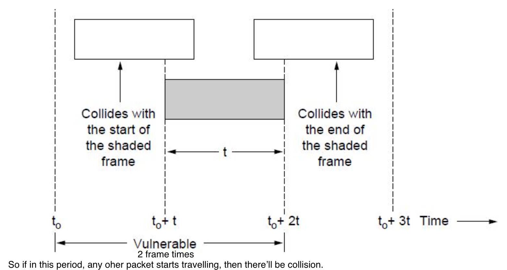

# Lecture 16

|Watch Video Lecture|
|---|
|[youtube link](https://youtu.be/KsMnsyAr_kM)|

---

# Medium Access Control Sublayer *(MAC)*

- In IEEE 802 LAN/MAN standards, the medium access control sublayer is the layer that controls the hardware responsible for interaction with the wired, optical or wireless transmission medium. The MAC sublayer and the logical link control sublayer together make up the data link layer.
- Mac Protocols : 
	- `802.3` - Ethernet
	- `802.11` - Wireless LAN
- Mac Protocols controls the operations of any LAN	 
- Network and MAC layer will different for different networks and LANs
- Data link has two parts : 
	- LLC Logical Link Layer (upper part)
	- MAC Medium Access Control (lower part)
	
- Channel Allocation Problem
- Multiple Access Protocols
- Ethernet (wired mac)
- Wireless LANs (wireless LAN)
- Not covered in this course (part of IOT) : 
	- Broadband Wireless
	- Bluetooth 
	- RFID
- Datalink layer switching
	- VLAN

- Multi-access link : Shared link

## **Slides** : 
	
- Responsible for deciding who sends next on a multi-access link
	> An important part of the link layer, especially for LANs

- **Channel Allocation Problem**
- For fixed channel and traffic from N users
	- Divide up bandwidth using FDM, TDM, CDMA, etc.
		- FDM : Frequency Division Multiplexing
			> Same like in FM radio. Frequencies are divided so  we can access multiple frequencies using single tuner as per our requirements.
		- FDMA : Frequency Division Multiple Access
		- TDM : Time Division Method
			> Division based on time. same time no same user.
		- CDMA : Code Division Method Access
			> differents codes 
	- There cannot be simultanuous transmission in single channel with one user.
	- Multiple Access is the only motive objective.
	- This is a static allocation, e.g., FM radio This static allocation performs poorly for bursty traffic
	- Allocation to a user will sometimes go unused
	
	- Therefore, we should use Dynamic Allocation in which algorithms is light so that overhead is minimum.
	Dynamic allocation gives the channel to a user when they need it. Potentially N times as efficient for N users.

- Schemes vary with assumptions:

| Assumption | Implication |
|---|---|
| Independent traffic (All users are independent; no one waits for no one) | Often not a good model, but permits analysis (practically not much possible as there can be dependencies) | 
| Single channel (only single channel to transmit; no other channels are available) | No external way to coordinate senders |
| Observable collisions (all devices who sent the packet will able to know that there is collision happened.; in some can be detected,in other cannot be!) | Needed for reliability; mechanisms vary |
| Continuous or slotted time | Slotting may improve performance | 
| Carrier sense (act like listening to other) | Can improve performance if available |
	

- Control channel can be used to transfer the addresses of each other (devices).
- Data channel can mostly used for transmit the data packets only.

- Multiple Access Protocols  (what's coming next?...)
	- ALOHA
	- CSMA (Carrier Sense Multiple Access)
	- Collision-free protocols
	- Limited-contention protocols
	- Wireless LAN protocols

- ## ALOHA : 
	- Simplest protocol which is as good as no protocol !
	- Purely based on HOPE :)
	- In pure ALOHA, users transmit frames whenever they have data; users retry after a random time for collisions
	- Efficient and low-delay under low load
		- No overhead (algorithm) so that its efficient.
		- only When traffic is very low.
		- No delay, as there is no checking.
	- Two varients : 
		- Pure ALOHA	(continuous time : `2t`)
		- Slotted ALOHA	(slotted time : `t`)
	- No `slotted time`, no `collision detection`, no `carrier sensing`
	- There is `share channel`(single channel), `Independent Traffic` is still there.
	- `HOPE FOR THE BEST`
	- Collisions happen when other users transmit during a vulnerable period that is twice the frame time
		- Synchronizing senders to slots can reduce collisions
			- to avoid this, (slotted ALOHA) If we've decided slots by each frame time then the vulnerable period will be 1 frame time.
		
	|Vulnerable period and Frame time for continuous/pure ALOHA|
	|---|
	||