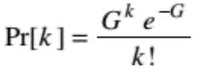
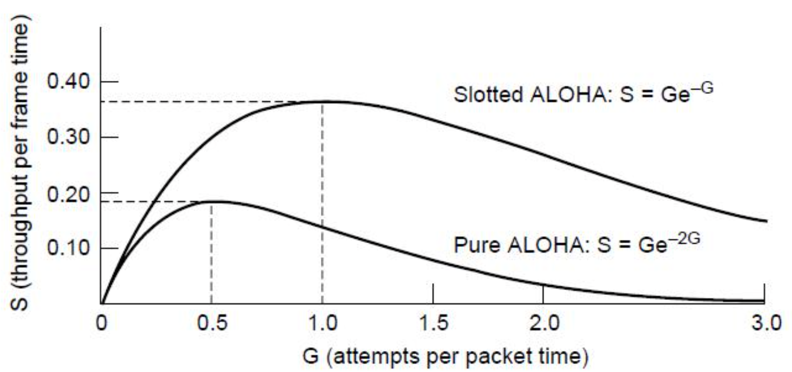
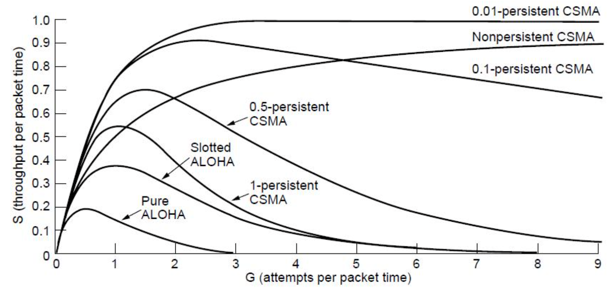
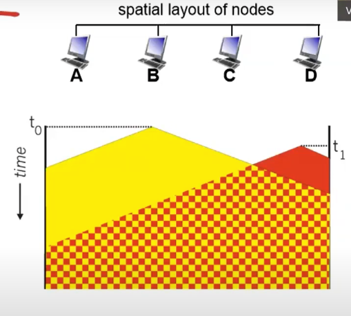
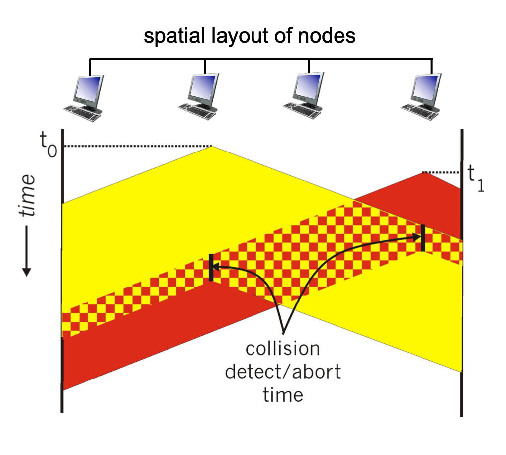

# Lecture 17

|Watch Video Lecture|
|---|
|[youtube link](https://youtu.be/Z1xGunPP9jM)|

---

- Efficiency of ALOHA
	- How many packets will be result in collision
- **frametime** – time needed to transmit standard sized frame
- **N** – New frames per frame time by poison distribution
	- All stations generates traffic independently
	- N is average number of packets generated per time.
- If N>1, nearly every frame will suffer a collision. 0<N<1 expected for reasonable throughput
	- every slot has more than one frame if N>1 so it will suffer collision
- G – mean number of frames/frametime including retransmissions. Clearly, `G ≥ N`.
	- If there is no retransmission : `G = N`
	- More the number of retransmission, more the value of G
- At low load (i.e.,N∼ 0), there will be few collisions, hence few retransmissions, so G≈N
- At high load G>N
- Throughput S is G x probability P0 of successful transmission
	- Number of frames which are transmitted successfully.
- `S = G * P0`

- The probability that k frames are generated during a given frame time in which G frame were expected, is given by the Poisson distribution

|Poisson Distribution Formula|
|---|
||

- So probability of no frame is e-G
- In an interval two frame times long, the mean number of frames generated is 2G. The probability of no frames being initiated during the entire vulnerable period is thus given by P0=e−2G. Using S=GP0, we get S=Ge−2G
- The maximum throughput occurs at G=0.5, with S=1/2e, which is about 0.184
	- This means throughput is 18.4% :  Around 18 frames will successfully transmitted after sending 100 frames
	- This is very low.
	- In slotted ALOHA its 37% which is almost double then pure ALOHA

- Slotted ALOHA is twice as efficient as pure ALOHA
	- Low load wastes slots, high loads causes collisions
	- Efficiency up to 1/e (37%) for random traffic models
	
|G vs S|
|---|
||

- ## Now Assumption changes : When Carrier Sensing is added : 
	- Carrier Sensing Multiple Access (CSMA)
	
	- CSMA improves on ALOHA by sensing the channel! 
	- User doesn’t send if it senses someone else
	- Variations on what to do if the channel is busy:
		- 1-persistent (greedy) sends as soon as idle
			- Continuosly sensing the medium (1 means 100%)
		- Non-persistent waits a random time then tries again
			- Not continous. tries after some time	(non means 0%)
		- p-persistent sends with probability p when idle
			- between above two.
			
- CSMA outperforms ALOHA, and being less persistent is better under high load

|G vs S|
|---|
||

- collisions can still occur after applying the CSMA : propagation delay means two nodes may not hear each other’s transmission
- collision: entire packet transmission time wasted
- distance & propagation delay play role in in determining collision probability

- CSMA/CD (CSMA with Collision Detection)
	- Hardware capabilities : 
		- Need full duplex transmission
	- worst case time to detect collision is almost same as **RTT**
	- CSMA CD is ethernet only
	- As propagation delay is too high in long distance transmission, CSMA CD is not worth for that. So, CSMA is only applicable for short distance transmission. *(typically used in LAN)*
	
|collision|collision detection|
|---|---|
|||

- In some shorter distance networks, it is possible to listen to the channel before transmitting
- In radio networks, this is called “ sensing the carrier”
- The CSMA protocol works just like Aloha except: If the channel is sensed busy, then the user waits to transmit its packet, and a collision is avoided
- This really improves the performance in short distance networks!

- In P-Persistent : P is the probability with which you transmit a frame if the medium is free.
	- Here even after we sense the medium is free, we are not transmitting the frame with 100% probability. 
	- Propagation delay : one time
	- RTT : two time (go and back)
- How long does a blocked user wait before trying again to transmit its packet? Three basic variants:
- 1-persistent: Blocked user continuously senses channel until its idle, then transmits
- 0-persistent: Blocked user waits a randomly chosen amount of time before sensing channel again

- Ideally value of P should be dynamic.

- P-persistent: Let T = end-to-end propagation delay
	- If channel is idle then transmit packet
	- If channel busy then toss coin [with
	P(heads) = P]
	- Heads: Transmit at first idle
	- Tails: wait until first idle plus T, sense, repeat
	> Human analogy: Don’t interrupt others

- ## Collision Detection

	- CSMA/CD: carrier sensing, as in CSMA 
		- collisions detected within short time
		- colliding transmissions aborted, reducing channel wastage
	- Collision detection:
		- easy in wired LANs: measure signal strengths, compare transmitted, received signals
			- difficult in wireless LAN, due to attenuation on some distance travelling, we cannot figure out this signal strengths and all etc.
			- **RSSI** : Received Signal Strength Indication *(used in mobile phone, for wireless communication.)*
			- Also as ethernet was full duplex but wireless networks are half duplex, we cannot perform this detection of collision.
		- difficult in wireless LANs: received signal strength overwhelmed by local transmission strength