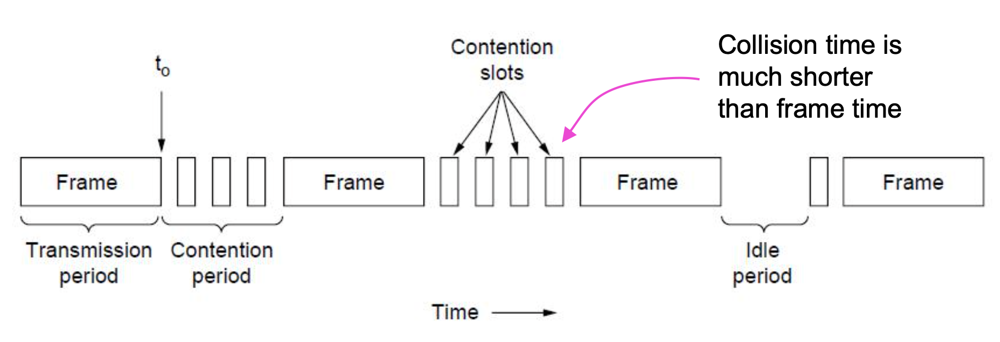

# Lecture 18

|Watch Video Lecture|
|---|
|[youtube link](https://youtu.be/oDn_1dyNtJ4)|

---

- **CSMA** : *(Carrier Sense Multiple Access)* Sense the medium before transmission.
- Persistent = continuous
- in p=0.01, there is high efficiency but delay is also more.
- MAC Protocols : 
	- Centralized MAC Protocols
		> Every station is not taking decision locally, but we have centralized station which'll take decisions for all. some Wireless has this protocols.
	- Distributed MAC Protocols
		> Every station is capable of taking the decision whether they should transmit or not. etc. ALOHA, CSMA, CSMA / CD etc. are Distributed MAC Protocols.
- CSMA/CD : Ethernet

- ## Numerical : 
	- If RTT is `20ms`, there are `1000 bits` to be transmitted and bandwidth is `1mbps`.
		- Transmission time : 103/106 = 10-3 s = 1ms
		- If collision is occurred at the end, then it will be detected at worst case time which is after 20ms *(RTT)*.
		- Then there are already 20 frames will be transmitted.
		- Collision detection have garbage signal so it doesn't have which frame was collided *(i.e. sequence number of that frame is not carried by this collision detection)*.
		- Ethernet doesn't have ACKs. so we cannot know which was last successful transmission.
		- requirement in Ethernet : **Frame transmission time should never be less then the ROUND TRIP TIME**.
	
	- Line bandwidth is `10mbps`. `50 micro seconds` is the RTT. what is the minimum frame length you need for you frame transmission so your transmission will continue for `50 microseconds`?
		- as in 1 second -> 10x106 bits
		- as in 50 micro seconds -> ? bits
		- 50x10^-6 x 10x10^-6
		- 500
		> **minimum frame length : 500 bits**
	- SO in general, in ethernet, there is atleast 500 bits requirement of bits. if there are smaller then this, then we can append zeros to it.
	- do round for saftey : 500->512 bits : 512/8 bytes : 64 bytes.
	- So, here, if we get any information of collision then it always be of the current sending packet because of our this new modification.
	- Almost all the wireless networks are half-duplex in nature.
	
- Slids collision detection : 
	- The minimum time to detect the collision is just the time it takes the signal to propagate from one station to the other
	- A station that has not heard a collision for a time equal to the full cable propagation time after starting its transmission can be sure it has seized/captured the cable/channel
		> After transmitting 64 bytes successfully, we can be sure that now there is no chance of collision. now you can safely transmit another bytes.
		> Frames affected by noise will be not affect the transmission. currently we are not checking this. this will be considered by receiver. in curroption, bits are inverted.
		> In case of collision, the signal voltage will changed. 
		> In case of collision, the complete signal will be garble.
	- Let the propagation time between the two farthest stations be τ.
	- At t0, one station begins transmitting. At t0+τ−ε, an instant before the signal arrives at the most distant station, that station also begins transmitting.
	- Second station immediately detects collision and aborts transmission
	- The little noise burst caused by the collision does not get back to the original station until time 2τ−ε
		> Collision is not happened at destination. so ε is very short time.
- All this discussed things will work for standard 10mbps ethernet. For high speed ethernet, there are other algorithms like frame busting for fast/gigabit ethernet.

- Contension - participating for one position; having chance of success in contest; Contestants;
	> All channel are fighting for the medium. only one of them can acquire the channel. they are all contending for the medium. the best of way resolving fight, there is requirement of deciding algorithms.
	- There is contension period for which all channels are fighting for acquiring the medium. this time is for resolvation and it will be wasted.
	- We'll see the algorithms for resolvation in coming sections...
	
	- CSMA/CD improvement is to detect/abort collisions 
		- Reduced contention times improve performance
		
|Contention Period|
|---|
||

