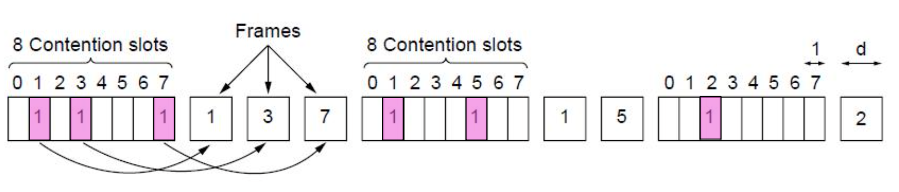
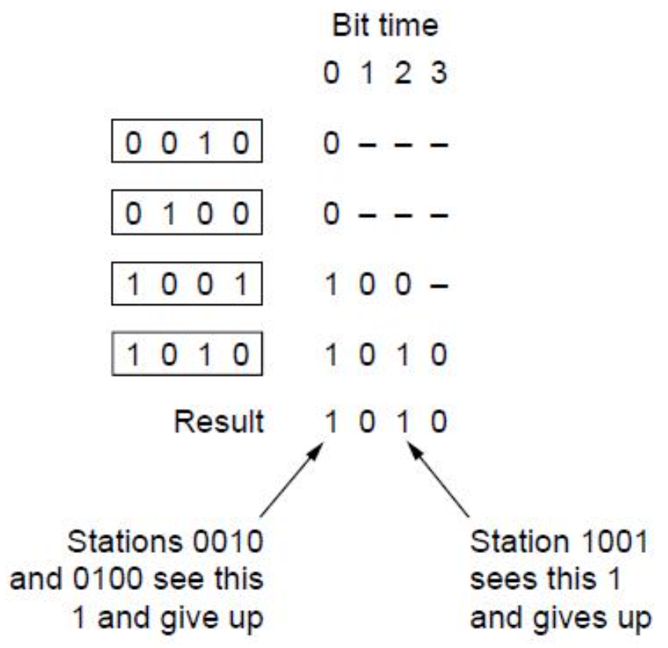
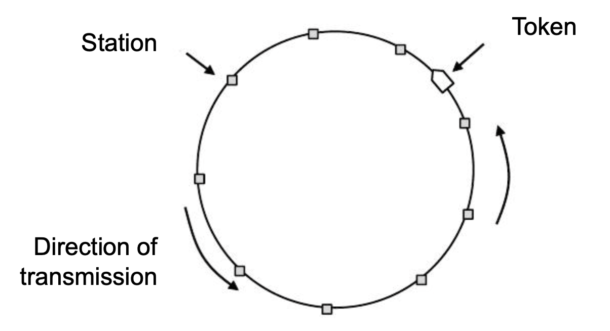

# Lecture 19

|Watch Video Lecture|
|---|
|[youtube link](https://youtu.be/chtIsB0bjq0)|

---

- Nobody can actually determine the number of slots of contentions. it's highly randomized. We can assume that width of every contention slots are `2t`. given a standard ethernet, RTT is `50 microseconds`. in standard ethernet, there is assumption that the distance b/w two farthest points is 2 km.

- Minimum frame length in ethernet : `64 bytes`.

- Slides CSMA/CD : 
	- Can we think of CSMA/CD contention as a slotted ALOHA system with a slot width of 2τ
		> No, we cannot. because here in slotted ALOHA, frame transmission after the RTT should be completed. but in CSMA-CD, the transmission will continue.
	- The difference for CSMA/CD compared to slotted ALOHA is that slots in which only one station transmits (i.e., in which the channel is seized) are followed by the rest of a frame.
	- This difference will greatly improve performance if the frame time is much longer than the propagation time
	
- Slides Collision Free Protocols : *(to do Reservation; no fights)*
	- Collisions adversely affect the system performance
	- In protocols to follow, we assume that there are exactly N stations, each programmed with a unique address from `0` to `N−1`.
	- Propagation delay is negligible
	
# Collision-Free Protocols 

- ## Bitmap

	- n=8
	- every slot is of one bit.
	- frame size of every frame is `d bits`.
	
	Collision-free protocols avoid collisions entirely
	- Senders must know when it is their turn to send
	- The basic bit-map protocol:
		- Sender set a bit in contention slot if they have data
		- Senders send in turn; everyone knows who has data
		
|Bitmap protocol|
|---|
||

- points 
	- here sequence wise transmission will take place. 
	- here the frames which have to transmit something, will fill 1 in them. like frame 1, 3, 7 in first reservation window.
	- first 7 then 3 then 1 will transmit. after this slot and when all frames were transmitted, another new slot will be generated.
	- In the third reservation window, there is `lower load`, in which only one station wants to transmit but there are N stations waiting for it. So here large over head is also present (reservation time wasted).
	
	- Performance
		- measure time in units of the contention bit slot, with data frames consisting of d time units
		- Under conditions of low load
		- A lower numbered station has to wait `N+N/2` slots **(delay/waiting time)**
		- Higher numbered station has to wait for N/2 slots
		- The mean delay for all station is `N` slot	**(average delay)**
		- Channel efficiency: The overhead per frame is N bits and the amount of data is d bits, for an efficiency of `d/(d+N)`.
		- Under conditions of high load
		- The mean delay for a frame is `(N−1)d+N`
			- `N` is the time you spent in contention window.
			- (N-1)*d is the time when other channels are transmitting.
		- Channel efficiency: The overhead per frame is 1 bits for an efficiency of `d/(d+1)`.
			- Nd/(Nd+N) = d/(d+1)
			- per frame, there is overhead of one bit.
			- At higher load, this kind of system works well.
		
		- Extra 
			- for every frame there is N bit of overhead is required at lower load.
			- IN high load, almost every frame is ready to transmit something.
			
		- Issues
			- Stations' access to the network is unfair: That is, if station i and station j both want to transmit, and i < j, then station i always first to transmit.
			- low numbered stations have to wait longer than high numbered stations for the reservation to complete.
			- Efficiency: at low load, the protocol efficiency is low.

- ## Collision-Free – Countdown *(Binary Countdown)*
	- Binary countdown improves on the bitmap protocol
		- Stations send their address in contention slot (log N bits instead of N bits)
		- Medium ORs bits; stations give up when they send a “0” but see a “1”
		- Station that sees its full address is next to send
	- here :
		- basic objective is to identify the highest number station.
		- 16 stations; each address of 4 bit. *(overhead of 4 bits)*
		- overhead per frame : Log2 N bits to be sent; where N is the number of stations.
		- Efficiency to send `d` frame : d/d+log2N
		- 4 bit : 4 contention slots
		- result is done by `OR`.
		- MSB -> LSB
		- If higher number has one like in below examples, 3rd and 4th slot has one, so 1st and 2nd slots will give up. and not send next bits.
		- At lower load, this binary countdown performs better than bitmap protocol (it had efficiency at low load : d/d+N)
		- Performance : 
			- The channel efficiency is d/(d+log2N)
		
|Binary Countdown|
|---|
||

- ## Collision-Free – Token Ring
	- points :
		- kind of LAN 
		- token is the bit stream.
		- computer/station which has token can send ONE frame to another along with that token.
		- same like ball passing game.
		- there is no chance of COLLISION.
- Token sent round ring defines the sending order
	- Station with token may send a frame before passing
	- Idea can be used without ring too, e.g., token bus

|Token Ring|
|---|
||

- ## Conclusion
	- **It is concluded that contention based systems performs better at lower load and reservation based protocols performs better when at higher load.**
	- Is it possible to design an adaptive solution which works like contention system at lower load and like reservation system when load increases ?
		> Now we have to design an ADAPTIVE / DYNAMIC system.
