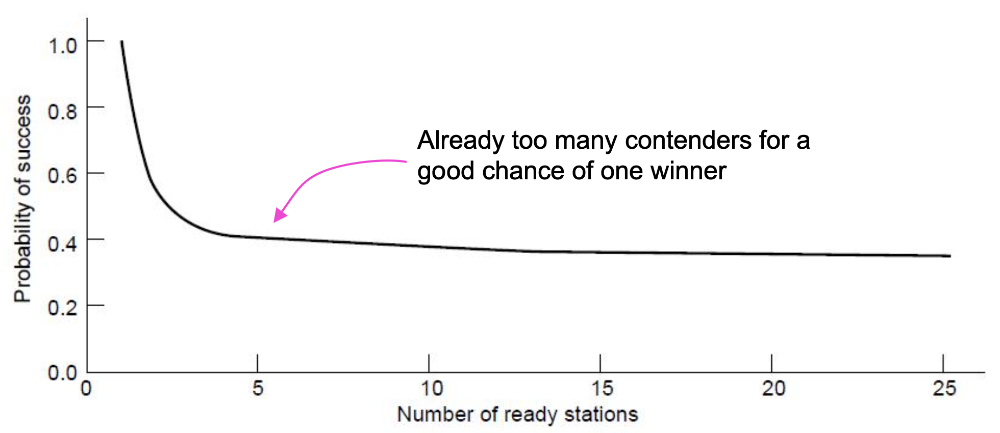
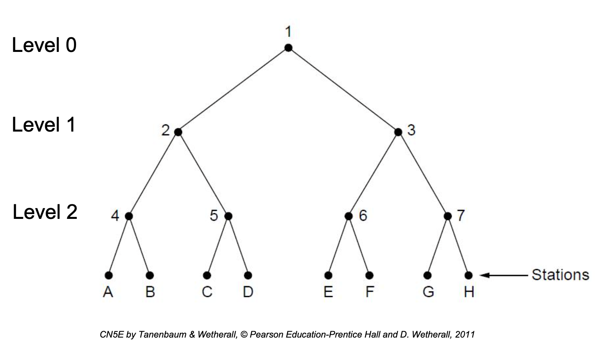
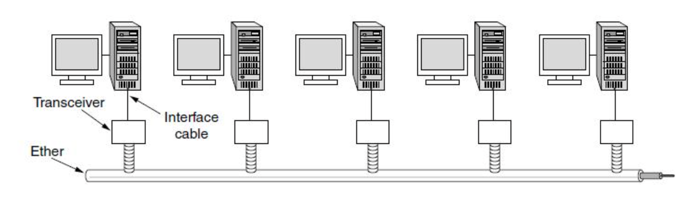
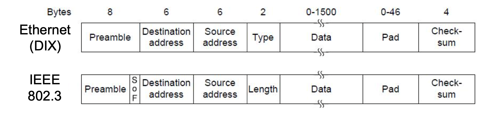

# Lecture 20

|Watch Video Lecture|
|---|
|[youtube link](https://youtu.be/a1HK0avnsfw)|

---

- ## Limited-Contention Protocols
	- Idea is to divide stations into groups within which only a very small number are likely to want to send
	- Avoids wastage due to idle periods and collisions
		- k station with probability p of transmitting in a slot
		- Probability of success = kp (1-p)k-1
		- To find optimal value of p, differentiate wrt p, set it 0 and solve for p
		- `p = 1/k`, substituting gives
			> Here `p value` *(Probability)* should be `1/k` in p-persistent. where k is the number of stations.
			
		- substituting p=`1/k`in eq. 
			- pr[success with optimal p] = [(k-1)/k]k-1

|Probability of success `P` vs ready stations `K`|
|---|
||

- As contention is increasing, the probability decreases.

- ## Adaptive Tree Walk
	
	- Tree divides stations into groups (nodes) to poll
		- Depth first search under nodes with poll collisions
		- Start search at lower levels if >1 station expected
		
|Adaptive Tree Walk|
|---|
||

- points :
	- Ideally for max efficiency : we should start with ceil(log2(Active transmission))
	- Tree divides stations into groups (nodes) to poll
		- Depth first search under nodes with poll collisions
		- Start search at lower levels if >1 station expected
		- Which is ideal level to start with ?
		- Assume each station has estimate of ready stations q
		- Each node at level i has a fraction 2-i of the station below it
		- If q ready stations are uniformly distributed, expected number of ready stations under a node at level i is 2-i q
			> equate this to 1. 
			
			> 2-i * q = 1
			
			> will get below result.
		- Ideally it should be 1 means i=log2 q
			> i = level number
			
# Exmaple Networks

- Ethernet
- Wireless LAN

- ## Ethernet
	- Classic Ethernet » : 3-10 mbps
	- Switched/Fast Ethernet » : 10-100 mbps
	- Gigabit/10 Gigabit Ethernet » (currently in use) : 1gbps
	
- Classic Ethernet – Physical Layer
	- One shared coaxial cable to which all hosts attached
		- 3 to 10 Mbps, with Manchester encoding
		- Hosts ran the classic Ethernet protocol for access
		- no hub, no switch
		- bus topology.
		- coaxial cable was originally made of `ether` so its called **ETHERNET**
		- signals/packet will be broadcasting.
			> Correct destination will receive. other will discard.
			
		- Manchester encoding done.
			> In telecommunication and data storage, Manchester code is a line code in which the encoding of each data bit is either low then high, or high then low, for equal time. It is a self-clocking signal with no DC component. Consequently, electrical connections using a Manchester code are easily galvanically isolated.
			
	- **Thick Ethernet** - Thick coaxial cable with segment length of `500 m` with each segment can have `100 PCs`
		- Repeater at the end can be used in case of longer length ethernet cables. it regenerates the signals.
		- `10 base 5`
			- 10 mbps
			- base means baseband signal; digital transmission.
			- 5x100 = 500 signal length
	- **Thin Ethernet** - Thin and flexible coaxial cable with segment length of `185 m` with each segment can have `30 PCs`
		- can consider `200 m`.
		- `10 base 2`	[*CAT 5*]
			- 2x100 = 200 m length 
	- Nowdays, `10 base t` is used
		- t stands for twisted pairs.
		- it has 8 wires; in pair of 4.
		- four solid colors :  blue green brown **orange**.
		- four mix.
	- Repeaters can be used to extend the length of Ethernet beyond the max segment length
	
|Classic Ethernet with Co-Axial Cable|
|---|
||

- MAC protocol is 1-persistent CSMA/CD (earlier)
	- Random delay (backoff) after collision is computed with **BEB** (Binary Exponential Backoff)
	- Frame format is still used with modern Ethernet.
		
|classic DIX Ethernet and IEEE standardization|
|---|
||

- Preamble : is needed for synchronization
	- never counted as a part of frame.
- Destinatoin : MAC address
	- 48 bit number : 6byte
	- ethernet address
- Source Address
	- 6byte
- type : decides whether is will carry IP packet or other

- pad : padding
	- 0-46 bits

- checksum : to protect frame

- New IEEE standard : 
	- preamble is now of `7` bytes rather than of `8` bytes in classic DIX ethernet.
	- SOF flag introduced.

- All the types values are greater than `1518`. And length values are less then 1518.
	> As, 6+6+2+4 + 1500 = 1518.
	- so type value has to be greater then 1518.

- Preamble is 101010... pattern. The last 2 bits are set to 11. Manchestor encoding of this pattern produces a square wave which is used for synchronization
- Address - beginning with 0 is normal address while address commencing with 1 is multicast or broadcast address
- MAC addresses are globally unique
- Type/Length - type indicates the kind of contents carried by the frame like 0x0800 means IPv4. If the number is less than 0x600 (1536), it is intepreted as length else as type to ensure compatibility between both versions
- Data - Maximum 1500