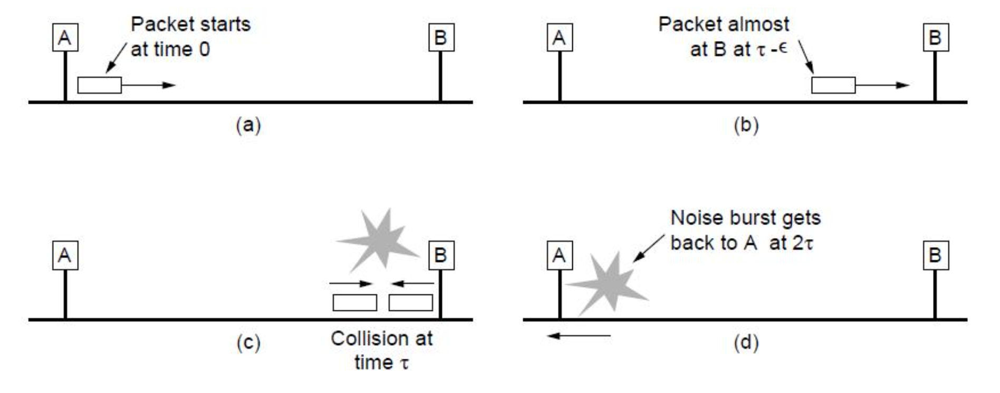
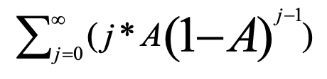
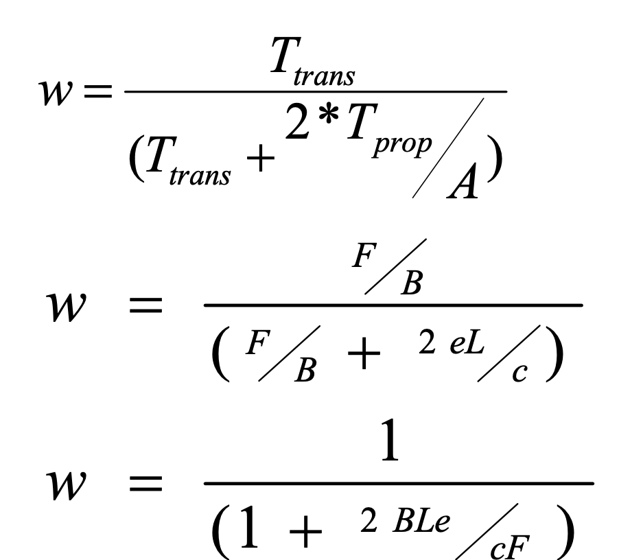
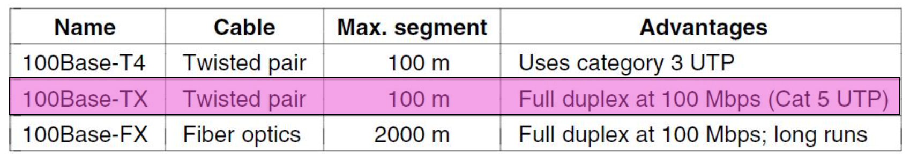
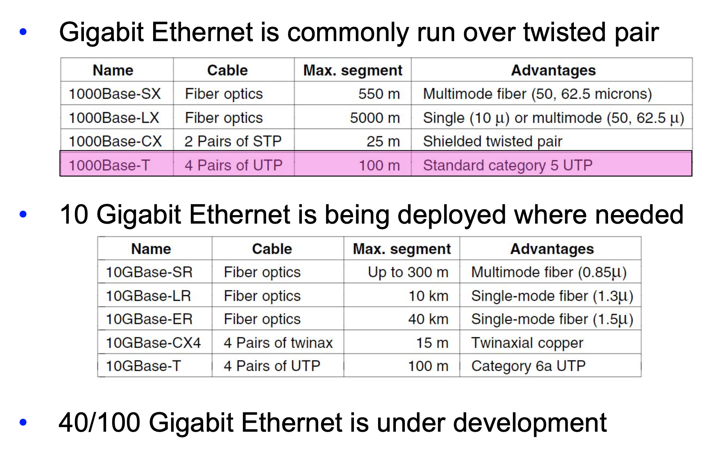

# Lecture 21

|Watch Video Lecture|
|---|
|[youtube link](https://youtu.be/tcr3PMsWhSA)|

---

- 46 is minimum bits required in payload field in order to insure that total length of the frame is 64.

- ## Classic Ethernet (MAC)
	- Collisions can occur and take as long as `2*Tau` to detect
		- `Tau` is the time it takes to propagate over the Ethernet
			- Tau is one way propagation delay
		- Leads to minimum packet size for reliable detection
	
|Collision|
|---|
||

	
- NIC : Network Interface Card *(LAN card)*
	1. NIC receives datagram from network layer, creates frame
	2. If NIC senses channel idle, starts frame transmission. If NIC senses channel busy, waits until channel idle, then transmits.
	3. If NIC transmits entire frame without detecting another transmission, NIC is done with frame !
		- without detecting collision till Round Trip Time
	4. If NIC detects another transmission (collision) while transmitting, it aborts and sends jam signal
	5. After aborting, NIC enters **binary (exponential) backoff**:
		- after mth collision, NIC chooses K at random from {0,1,2,..., 2m-1}. NIC waits K·512 bit times, returns to Step 2
		- longer backoff interval with more collision
		- If 0 then you have zero slots for waiting
			- directly transmission.
		- If 1 comes then you have to wait for 51.2 micro seconds.
		- contention window includes two numbers 1 and zero for 2 devices.
		- After more collision this algorithms also increases the delay time as K increases. like if k is chosen as 1024 then it will have to wait until 51.2 * 1024 micro seconds = 0.05 seconds = 50 ms .
			- this is too much waiting/delay.
	
- ## Efficiency of Ethernet
	- to find it, we have to calculate contention period as  `total frame time` = `frame time` + `contention period`. and efficiency of ethernet can be calculated by frame time / total time.
	- Try to find mean duration of contention interval Or
	- mean number of contention slots in a contention interval
	- Assume k node is contending in contention period
	- k is number of stations.
	- Assume each node transmits with a fixed probability p in any slot
	- What is the probability (‘A’) that some station acquires the channel in a slot (for successful transmission)?
	- A = p(1-p)k-1 + p(1-p)k-1 +... k times = k p(1-p)k-1
	- A is maximized when p =1/k, with A => 1/e as k tends to infinity.
	
	- The probability (Pj) that a contention interval has exactly j slots?
	-  (after the collision, the least size of back-off interval chosen by some node is j slots or, what is the probability that some station transmits only at jth slot and not in previous j-1 slots?)
	- p(Not transmitting in 1st slot)= (1-A)
	- p(Not transmitting in 1st slot and 2nd slot)= (1-A)(1-A)
	- Pj= A(1-A)j-1 ---------------------------------------------(1)
	- Over a long period of time, the mean number of slots per contention interval is given by
	
|Mean number of slots formula|
|---|
||
		
- Assuming optimal p, the mean number of contention slots is never more than 1/A or e
	- Here in above equation, we have to take A = 1/e and p = 1/k (optimal value of p)
	- get ans = 1/A
	- Min value of A is 1/e => final ans is `e`.

- Since each slot is 2*Tprop, 
- Tprop is one way propagation delay of one slot. here, mean number of slots as calculated above is `1/A`. so total contention period is `mean number of slots` x `T`prop
- Channel Efficiency = w = Ttrans / (Ttrans) + (Tcontention period)
	- Mean length of contention interval is
	- Tcontention = 2* Tprop /A
	- Now if Ttrans is time needed for transmitting mean packet size then
	- Channel efficiency (w) is = time required to transmit in absence of collision/ time required to transmit in presence of collision
	- w = Ttrans / (Ttrans + 2* Tprop /A)
	- So longer the propagation time Tprop(cable length!), the longer the contention interval.
	- The longer the contention interval, the lesser the efficiency / throughput

- Perforamnce

- Transmission Time : Frame length / Bandwidth
- Assume the frame length is F, the network bandwidth, B, the cable length, L, and the speed of signal propagation, c
	- Ttrans =F/B 
	- Tprop =L/c
	- substituting it in throughput/efficiency equation
	
|Calculation formula|
|---|
||

- e and c are constants

- Efficient for large frames, even with many senders 
	- Degrades for small frames (and long LANs)

- Switched/Fast Ethernet
	-  Cat5 cables used; 10 base T.
- Hubs wire all lines into a single CSMA/CD domain
- Switches isolate each port to a separate domain
	− Much greater throughput for multiple ports
	− No need for CSMA/CD with full-duplex lines
		- collision detection
	
	- switch makes routing table of mac addresses.
	- Switch only sends the specific target destination device unlike hub which sends to all the connected devices
	- Parallel transmission in switch are permissable.
	- in hub you cannot do parallel transmission but in switch, you can. so there is more throughput in switch than hub.
	- switch maintains buffer
	-  switch : Intelligent device
	-  hub : not Intelligent device
	
	- Switches can be wired to computers, hubs and switches
		- Hubs concentrate traffic from computers
		- More on how to switch frames the in 4.8
		
		- hub is a multiport repeater.
		- switch has also repeater functionality.
		
		- Internet standards for creating ethernet cable : 
			- T568A
				- shows sequence of colors
			- T568B
		- Fast Ethernet extended Ethernet from 10 to 100 Mbps 
			- Twisted pair (with Cat 5) dominated the market
 
|Table of cables|
|---|
||

- if only 3 wire + 1 wire = 4 wire => Half duplex ethernet
- IF all 8 wire  => Full duplix ethernet

- same color on both side ethernet => Straight
- different color on both side ethernet => cross cable.

- Gigabit ethernet
	- Switched Gigabit Ethernet is now the garden variety
	- With full-duplex lines between computers/switches

|Gigabit table|
|---|
||
	
- wave length is described in micro
- STP : Sheilded Twisted Pairs
- UTP : UnSheilded Twisted Pairs