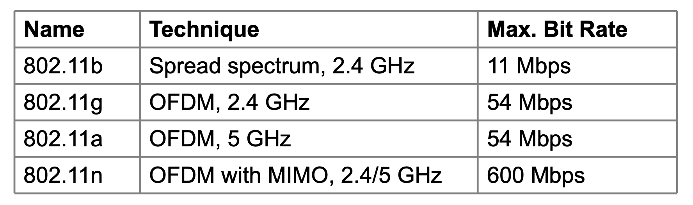

# Lecture 22

|Watch Video Lecture|
|---|
|[youtube link](https://youtu.be/jcqpBoG4D80)|

---

- All wireless devices are half duplex.
- Slide content : 
	```
	- Wireless has complications compared to wired. Nodes may have different coverage regions
		• Leads to hidden and exposed terminals 
	- Nodes can’t detect collisions, i.e., sense while sending
		• Makes collisions expensive and to be avoided
	```

- Hidden node problem : 
	```
	Hidden terminals are senders that cannot sense each other but nonetheless collide at intended receiver
	• Want to prevent; loss of efficiency
	• A and C are hidden terminals when sending to B
	```

- Exposed terminals problem : 
	```
	Exposed terminals are senders who can sense each other but still transmit safely (to different receivers)
		• Desirably concurrency; improves performance
		• B->A and C->D are exposed terminals
	```

- These kind of problems will not happen in ethernet as there is always broadcasting.

- How to avoid : 
	- **CSMACA** - Carrier Sense Multiple Access Collision Avoidance 
	- RTS : Request to Send
	- CTS : Clear to Send

- MACA : 
	```
	MACA protocol grants access for A to send to B:
		• A sends RTS to B [left]; B replies with CTS [right] 
		• A can send with exposed but no hidden terminals
	```
	
- 802.11 : Wireless LAN standard
	```
	• 802.11 architecture/protocol stack »
	• 802.11 physical layer »
	• 802.11 MAC »
	• 802.11 frames »
	```

- Access point : Layer 2 device
- Router : Layer 3 device

- Router of 6 ports : 5 LAN ports, 1 WAN port :
	```
	Wireless clients associate to a wired AP (Access Point)
		• Called infrastructure mode; there is also ad-hoc mode with no AP, but that is rare.
	```
	- MAC Address for router : 
	- IP Address for router : 
	
- Two access points are connected through LAN which is called as **DISTRIBUTION SYSTEM**
	- Wired part of network is called distributed system. on that part we can have switches and on switch we can have many other ethernets.
	- Distributed system is like an existing ethernet and one port of the switch is connected to access point
- Uppar part of Data link layer is called as Logical Link Layer (LLC) and Lower part of link layer is called as MAC.

- 802.11a : 5ghz band	(frequency band in which LAN works)
	- **DSS : Direct Sequence Spread Spectrum**
- 802.11b : 2.4ghz band 
- 802.11g : 2.4ghz band 
- 802.11n : 2.4ghz band 

- now : 802.11an

- If you are moving, from a to g your physical layer changes. MAC layer doesn't.

- **Spread Spectrum** : In telecommunication and radio communication, spread-spectrum techniques are methods by which a signal generated with a particular bandwidth is deliberately spread in the frequency domain, resulting in a signal with a wider bandwidth.
	- Narrow band signals spreads and its bandwidth is increases. noise immunity will increase by this signal processing technique. and data-rate available will also increase.

- OFDM : Orthogonal Frequency Division Multiplexing

- dual band router supports 2.4GHz and 5GHz.
	- 5 GHz will give more speed. as 
	- 2.4 GHz will give less speed as compared to 5 GHz.
		- Lower the frequency range, higher will be the range which it can travel.

	- Lower frequency means High wavelength. *(inversly propotional.)*
	- Longer the  wavelength, longer  is the range.
	
	
|Physical layer table|
|---|
||

- Mac Layer 1
	```
	Traffic services 
	• Asynchronous Data Service (mandatory) **[Contention Based]**
	− exchange of data packets based on “best-effort”
	− support of broadcast and multicast
	• Time-Bounded Service (optional) **[Centralized Based]**
	− implemented using PCF (Point Coordination Function)
	Access methods
	• DFWMAC-DCF CSMA/CA (mandatory) **[Distributed Coordition Funation]**
	− collision avoidance via randomized „back-off“ mechanism
	− minimum distance between consecutive packets
	− ACK packet for acknowledgements (not for broadcasts)
	• DFWMAC-DCF w/ RTS/CTS (optional) **[Distributed Coordition Funation]**
	− Distributed Foundation Wireless MAC
	− avoids hidden terminal problem
	60
	• DFWMAC- PCF (optional) **[Point Coordition Funation]**
	```

