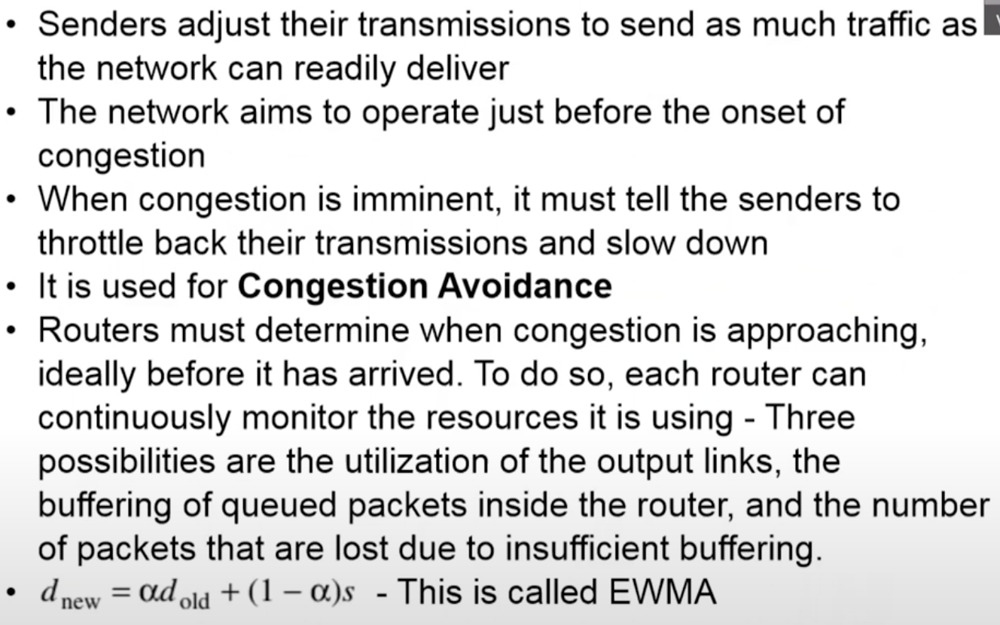
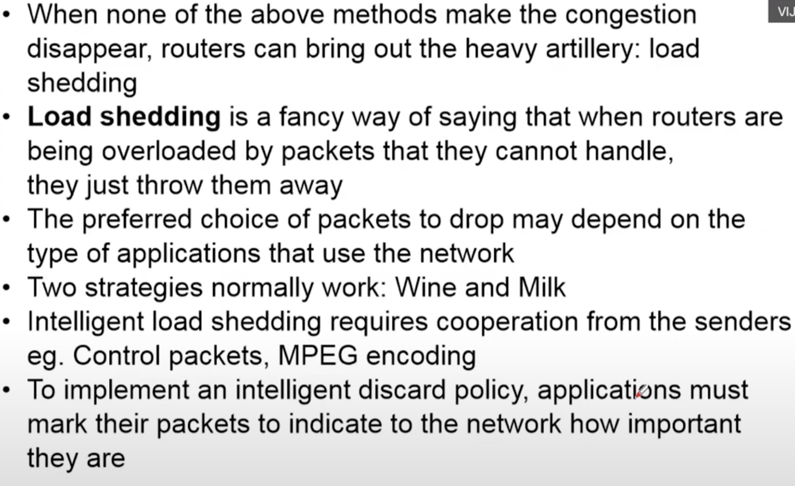

# Lecture 32

|Watch Video Lecture|
|---|
|[youtube link](https://youtu.be/fOKmvolxsXU)|

---

- ## Traffic-Aware routing
	- slide-points
		```
		
		• The most direct way to do this is to set the link weight to be a function of the (fixed) link bandwidth and propagation delay plus the (variable) measured load or average queuing delay 
				
		• Consider the network in next slide, which is divided into two parts, East and West, connected by two links, CF and El 
				
		• The routing tables may oscillate wildly, leading to erratic(unpredictable) routing and many potential problems 
				
		• If load is ignored and only bandwidth and propagation delay are considered, this problem does not occur. 
				
		• Two techniques can contribute to a successful solution. The first is multipath routing, in which there can be multiple paths from a source to a destination 
				
		• The second one is for the routing scheme to shift traffic across routes slowly enough that it is able to converge 
		```
	
	- multi path routing
		- primary , secondary paths, ...
		- ranks the paths
		
	- shift traffics
		- slowly shifting...

- ## Admission control

	- slide points
		```
		• The idea: do not set up a new virtual circuit unless the network can carry the added traffic without becoming congested 
		• Traffic is often described in terms of its rate and shape 
		• A commonly used descriptor that captures this effect is the leaky bucket or token bucket 
		• Armed with traffic descriptions, the network can decide whether to admit the new virtual circuit 
		• The traffic description is a service agreement for what the network will guarantee its users 
		• Admission control can also be combined with traffic-aware routing by considering routes around traffic hotspots as part of the setup procedure 
		```
	
	- based on traffic describers network can decide whether to admit that traffic or not.
	- SLA : Service level agreement is traffic describer
		- SLA will be mainted by the network.
	- traffic hotspot : highly congested routers
	
- ## Traffic throttling
	> 
	
	- attributes/parameter to identify the current state or router : 
		- utilisation
		- buffer
		- number of packets lost
	- EWMA : Exponetial Waited Moving Average
	- d_new = a \* d_old + (1-a) \* s
	- d = occupancy
	- s = instantanous measurement
	- alpha = weightage to data (historical weightage)

- ## Explicit congestion notification
	- new packet is generated to send the congestion notification. 
	- in ACK, congestion notification of the received packet is copied.
	- basic objective : to inform sender that congestion is happened
	- two ways : 
		- forward packet marking
		- backward packet marking [more useful]
	
	- choke packet: congestion notification packet
		- problem : it takes time
		- solution : hop by hop choke
			- disadvantage : other routers can affect althought they don't feel congestion 
				>  through increase in buffer.
			
			
- ## Load Shedding
	- discard the packet when nothing works
	> 
	- setting priority field
	
	- milk : fresh is better
		- live match is the examples
		- discard old packets
	- wine : old is better
		- internet download is the example
		- discard new packets
	
	