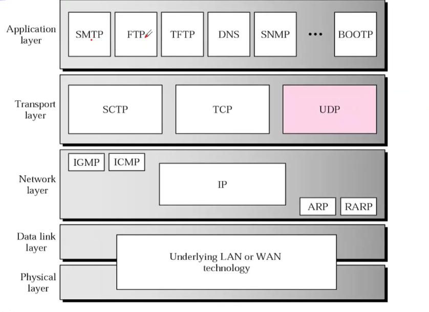
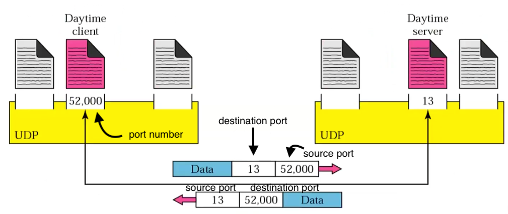

# Lecture 41

|Watch Video Lecture|
|---|
|[webex link](https://nirmauni.webex.com/nirmauni/ldr.php?RCID=4558857dc1ba96cd7335216d24862463) `jW9ep2PE`|

---

- ## Congestion Control
	```
	• Desirable bandwidth allocation	| 
	• Regulating the sending rate	 | Control rate of transmission
	```
	- before this, implementation of this was on network. not on sources.	 | at network layer
	
	
	- throughput : number of packets sending in 1 sec
		- physical layer data is sent by throughput
		- includes header
	- goodput : number of net databyte you can send
		- total number of data sent - header length
		- application layer data is sent by good put
- ## Desirable Bandwidth Allocation (1)		
	- in case of congestion, every packet will be queued. so the delay will increase.
	- goodput and delay alone cannot serve as indicator of performance.
	- rather `power=goodput/delay` is a good indicator
	- we will increase bandwidth until congesion arrives.
	
- ## Desirable Bandwidth Allocation (2)
	- Max-min bandwidth allocation for four flows
	
- ## Desirable Bandwidth Allocation (3)
	- Changing bandwidth allocation over time

- ## Regulating the Sending Rate (1)
	- A fast network feeding a low-capacity receiver
	
	- **Sending Data Rate(SDR)** = min(capacity of network and receiver)
	- minimum of the two will be datarate.

- ## Regulating the Sending Rate (3)
	- tcp has 40-50 varients
	- XCP : Explicit congestion control protocol
	- TCP with ECN : Explicit congestion notification
	- cubic tcp : linux has this.
	- compound tcp : windows has this.
	
	- `Fast TCP`, `Cubic TCP`, `TCP` : no explicit notification sent. but they notice implicit that congesion is happened by different methods like `end-to-end delay checking/monitoring`, `packet loss calculation`.
	
	-  Precise : precise guess of the congesition
	- header of tcp should be same for all the tcp varients

- ## Regulating the Sending Rate (4)
	- After some fix threshold, multiplicative increase should be converted into additive increase.
	- Additive Increase Multiplicative Decrease (AIMD) control law.
	- tcp doesn't start at high speed. it gradually increases the speed.
	- previously, the only reason for loosing the packet was congestion.
	- if any congestion is found, then we have to slow down.
		- current window size resets to one.
	- there is also concept of `Additive decrease/multiplicative`. which is used for congestion  control. but it's not used in TCP.
	- **AIMD : Additive Increase Multiplicative Decrease**
		- best possible  approach for control law.
		- 1. AIMD
		- 2. MIMD
		- 3. AIAD
		- 4. MIMD
	
- ## The Internet Transport Protocols: UDP
	```
	• Introduction to UDP
	• Remote Procedure Call
	• Real-Time Transport 
	```

- ## UDP : User Datagram Protocol
	
	> 

	- 1. connection less reliable less | UDP
	- 2. connection oriented reliable service | TCP

	- ftp : tcp
	- tftp : udp
	- dns : tcp, udp
	- http : tcp
	
	- timely delivery needed? : use **udp**
	- reliable delivery needed? : use **tcp**
	
	
	
- transport layer : process to process communication
	
	> 
	- 8 bytes of udp header
	
	- icann ranges
		- agency responsible for controlling port numbers and ip addresses
		
		- 0-1023 : reserved for  well-known services
			- http `80`
			- htp `22`
		- 1024-49151 : registered services
		- 49152-65535 : dynamic or private
		
	
	| Port | Protocol | Description |
	|---|---|---|
	| 7 | Echo |Echoes a received datagram back to the sender |
	| 9 |  Discard |  Discards any datagram that is received |  
	| 11  | Users |  Active users   |
	| 13 |  Daytime |  Returns the date and the time   |
	| 17 |  Quote  | Returns a quote of the day  |
	| 19 |  Chargen  | Returns a string of characters  |
	| 53 |  **Nameserver**  | Domain Name Service  **DNS** |
	| 67 |  Bootps |  Server port to download bootstrap information  |
	| 68 |  Bootpc  | Client port to download bootstrap information  |
	| 69 |  **TFTP**  | Trivial File Transfer Protocol  |
	| 111  |  RPC  | Remote Procedure Call  |
	| 123 |  NTP  | Network Time Protocol  |
	| 161 |  **SNMP**  | Simple Network Management Protocol |
	| 162 |  **SNMP**  | Simple Network Management Protocol (trap)  |

- `dns`,`tftp`,`snmp` uses tcp and udp both.

- `IP Address` : `Port Number` = `socket address`

- UDP packet are called user datagrams and have a fixed-size header of 8 bytes.
