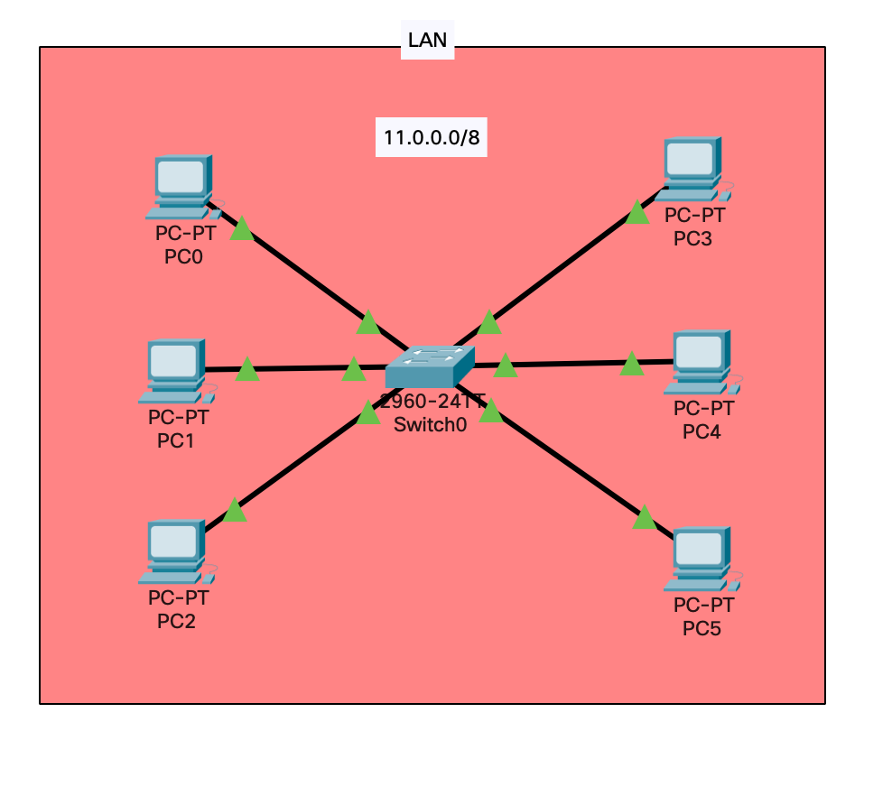
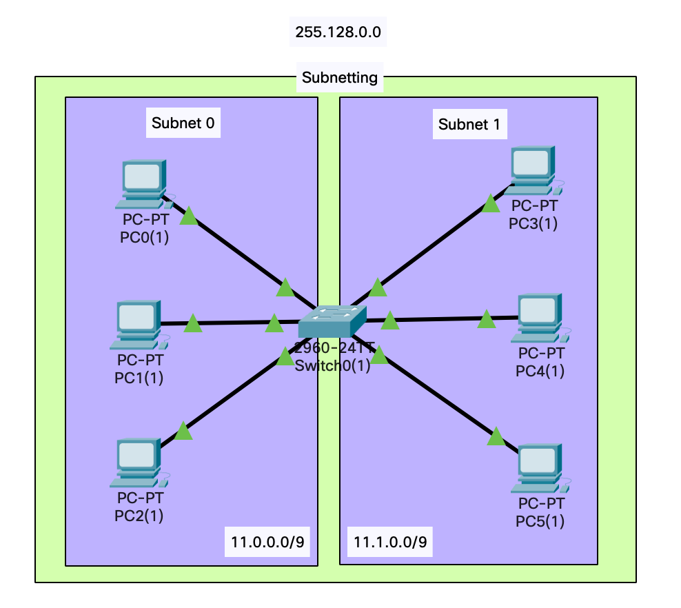
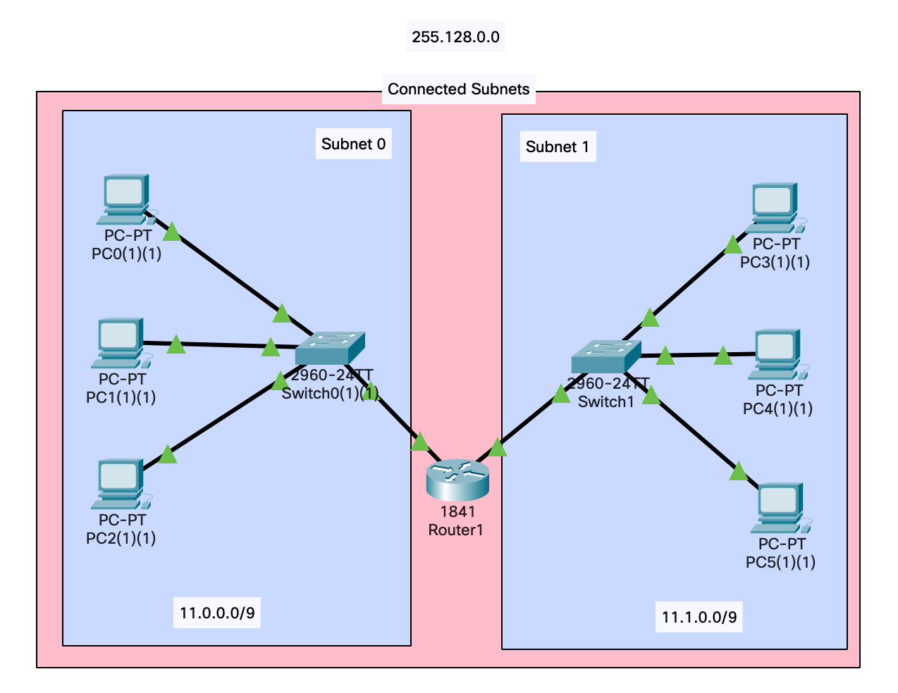
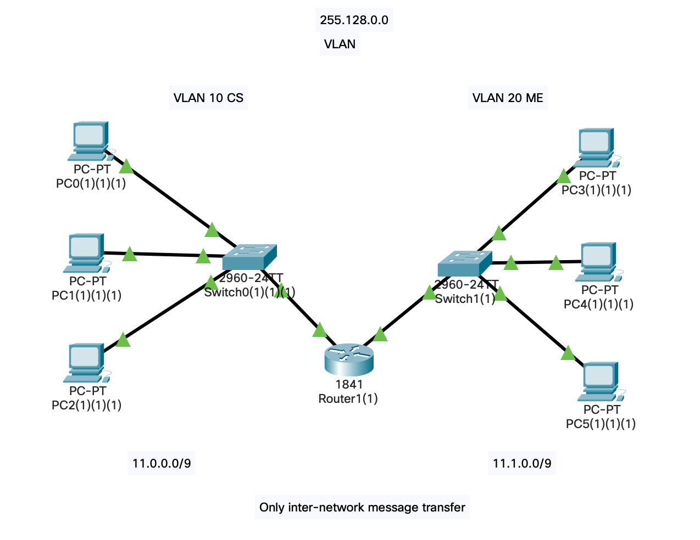
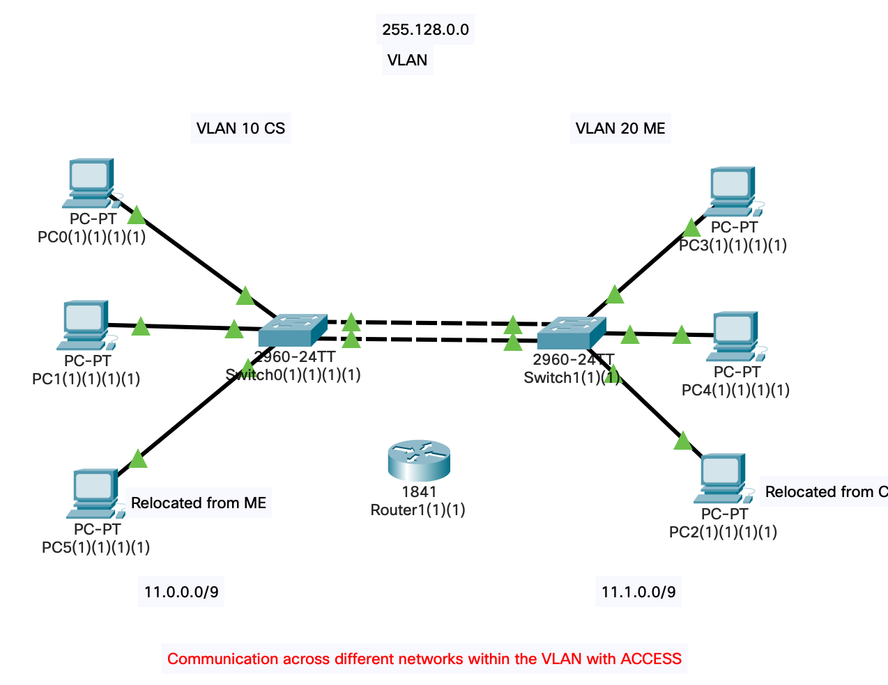
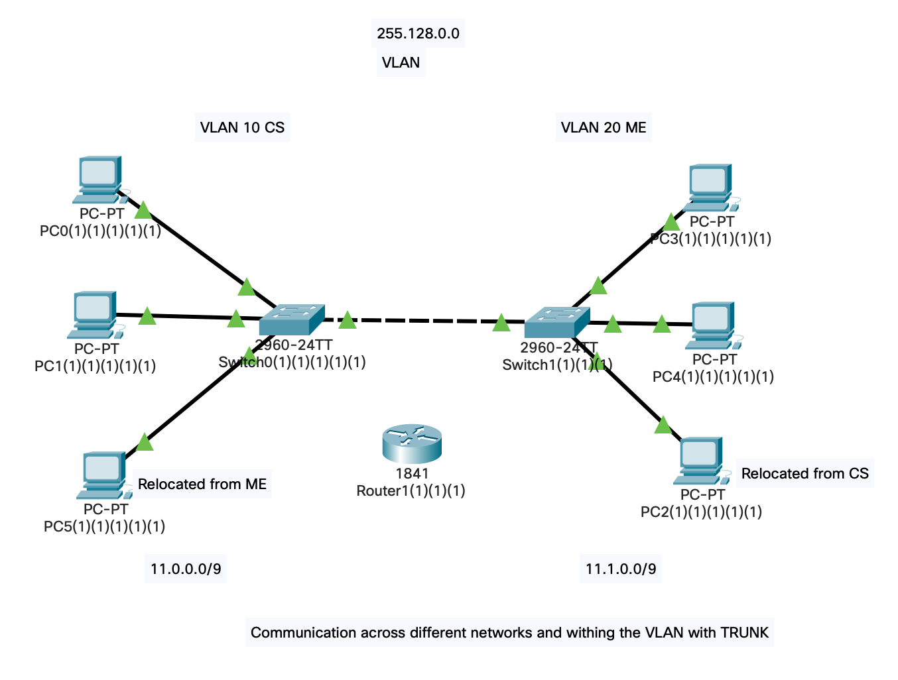
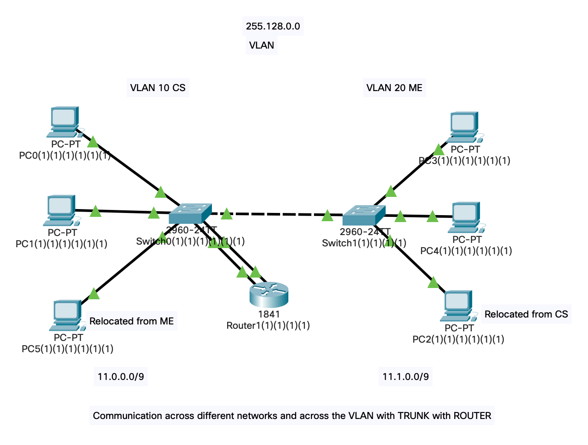

# LAB 3

[Watch Video Lecture](https://youtu.be/kSjhLQQd_iA)

## Single LAN

- We need not to remember port address of switch through which devices are connected in this LAN 
	> but in case of `VLAN` we'll need this.
- ARP is always a *broadcast* packet. first time anywhere you try to send the packet it will be **ARP** request. so it'll fail most probably.
- All ones in Destination address means Broadcasting.
	> It will be displayed by clicking on the packet in `simulation` and go to `Outbound PDU Details` and see Destination address which is displayed by `DEST ADDR: FFFF.FFFF.FFFF`
- One network is one broadcast domain.
	> Area within our broadcast packet is travelling is called Broadcast address.
- If one pc is affected with malware in this switch network then all PCs can affect in broadcasting.
	> In hub there is always broadcasting but in switch there is only unicast expect first ARP request.
- IPs, Subnet mask assigned : 
	- `11.0.0.1`,`255.0.0.0`
	- `11.0.0.2`,`255.0.0.0`
	- `11.0.0.3`,`255.0.0.0`
	- `11.0.0.4`,`255.0.0.0`
	- `11.0.0.5`,`255.0.0.0`
	- `11.0.0.6`,`255.0.0.0`

- Here broadcasting is an issue. It will be resolved in subnetting.

## Subnetting

1. Not Interconnected Subnet 

	- Here we are using **`CLASS A`** address
		- 32 bits
			- 8 bits network
			- 24 bits host
		- 11111111.00000000.00000000.00000000 = Subnet Mask = /8 
		- Subnet Mask : `255.0.0.0`
	- Here we want to make `2` subnets
		- Network + Subnet + Host 
		- 8 + 1 + 23
		- here 1 bit will be used represent subnets.
		- Subnet address is counted as network address.
		- new network addreess : `/9` : new network address : 8+1=9
		- 11111111.10000000.00000000.00000000
		- 255.128.0.0
	
	- New IPs and subnet-masks for all PCs
		- **Subnet 1**
			- `11.0.0.1`, `255.128.0.0`
			- `11.0.0.2`, `255.128.0.0`
			- `11.0.0.3`, `255.128.0.0`
		- **Subnet 2**
			- `11.128.0.4`, `255.128.0.0`
			- `11.128.0.5`, `255.128.0.0`
			- `11.128.0.6`, `255.128.0.0`
	- Now pinging /messaging inside one subnet will work fine.
		- Message from one computer to another computer in same subnet will be *(only)* successful.
		- As network address of one subnet's PC and another subnet's PC are different, the message will not be successful.
	- We cannot use same IP in different subnets.

2. Interconnected Subnets

	
	
	- Separate two subnets with individual switches.
	- For this, we need layer 3 device router.
	- Router has 2 interface : 
		- FastEtherneet 0 :conncted to subnet 1's 21th port
		- FastEtherneet 1 :conncted to subnet 2's 21th port
	- **Configure router**
		- Go to router config / `FastEthernet 0/0` 
			- Assign ip : `11.0.0.100`
			- Assign subnet : `255.128.0.0`
			- Turn on `Port Status`
		- Go to router config / `FastEthernet 0/1` 
			- Assign ip : `11.128.0.100`
			- Assign subnet : `255.128.0.0`
			- Turn on `Port Status`
	- Now router configuration is over but still you cannot send message from one subnet's pc to another subnet.
	- for this, you have to set Default gateway for each device.
		- For **Subnet 1** : 
			- Default gateway is `11.0.0.100` *(Ip address of connected router to FastEthernet0/0)*
		- For **Subnet 2** : 
			- Default gateway is `11.128.0.100` *(Ip address of connected router to FastEthernet0/1)*
			
	- Now you will be able to send messages from one subnet to another subnet.
		> First request will be ARP to figure out the mac-address.
		> `ICMP` cannot start until `ARP` request is over.
	- to find ARP entries : 
		- go to command promt of pc and give this command : `arp -a`
- Broadcasting now only contained inside the subnet. Not on whole network.
- Advantages of subnetting : 
	- If one PC affected with malware or something and starts broadcasting repeatedly, then other computers in another subnet will not be affected by this
	- Easier management
	- This is physical division of the network.

## VLAN

- Virtual LAN is Better than subnetting.
- Here there will be more configuration in switch.
- By default every switch has VLAN number 1 `Default` created.
	- All ports in that switch are member of that VLAN ports by default.
- In switch, There are interfaces 
	- Each interface has VLAN port which can work like `Access` or `Trunk`
	- for `Access`, it can connect to an end device. by default every port is `Access`. to this port we normally connect computers.
- Here two networks : 
	1. `CS` : Computer Department
	2. `ME` : Mechanical Department
- **Configure switch**
	- `Switch 1` config
		- go to FastEthernet `0/0`,`0/1`,`0/2` select network port `Access` and VLAN `10 CS`
	- `Switch 2` config
		- go to FastEthernet `0/11`,`0/12`,`0/13` select network port `Access` and VLAN `20 ME`
- After doing this, we can transfer messages inside one network. we still cannot transfer messages from one network to another network
	- Link b/w switch 0 and any device from pc0,1,2 can only carry `VLAN 10` traffic. as switch port is set to `Access`,`VLAN 10`.
	- Link b/w switch 1 and any device from pc11,12,13 can only carry `VLAN 20` traffic. as switch port is set to `Access`,`VLAN 20`.
	
- **Without changing the IP relocate PC from one network to another network**

	

	- remove router from b/w two switches
	- connect two switches via `Copper cross over` wire
		- first switch on `0/20` port and another switch on `0/22` port.
		- Make `0/20` port both side switches to `VLAN 10`
		- Make `0/22` port both side switches to `VLAN 20`
	- relocate `pc 2` to `ME` department switch `0` on `port 21`
	- relocate `pc 5` to `CS` department switch `1` on `port 21`
	- Now you can send messages across networks on from pc0,1 to pc2
		- And you can send messages across networks on from pc3,4 to pc5
	- *So for communication, There should be link of same VLAN on path from one computer to another computer*
	- **NO CHANGE IN IP CONFIGURATION REQUIRED here**
	
- **Make VLAN port from `ACCESS` to `TRUNK`**

	

	- remove 2 wires b/w two switches and connect one wire on port `20` and make it `trunk` from configuration of two switches on port FastEthernet `0/20`.
	- If you make port as `trunk` then you **CANNOT** connect computer. you can  only connect `switch`. If done so, the computer will not be member of any VLAN.
	- Here communication is only done WITHIN the VLANs.

- **Communication across the VLAN using ROUTER**
	
	
	
	
	- Connect a router to `switch 0`
		- on port `4` : to FastEthernet `0/0` : Make `VLAN 10`
		- on port `14` : to FastEthernet `0/1` : Make `VLAN 20`
	- Now you can communicate across the VLANs
	- To transfer message across different VLANs, we need ROUTER.
	- Here router is only connected to switch 0 and still be able to transfer messages across different VLANs. Why?
		> Because it is important to connect a router to both VLANs. Here it is not important to connect router to both switches. our requirement is to connect both VLANs, whether we allot :
			- switch 0's port VLAN 10 and switch 1's port VLAN 20  **OR**
			- switch 1's port VLAN 10 and switch 2's port VLAN 20 **OR**
			- switch 1's port VLAN 10 and switch 1's port VLAN 20 **OR**
			- switch 0's port VLAN 10 and switch 0's port VLAN 20 **(WHICH WE DONE HERE)**

- For extra ethernet port on router, go to `physical` in router and select `WC-1ENET`. also explore other plugin cards.
	- turn off the router and apply card and turn on again 