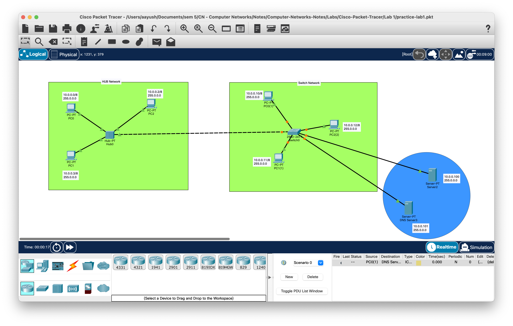

# LAB 1

[Watch Video Lecture](https://youtu.be/11KHGdzvdEY)

- Hub
	- It broadcast the message
- Switch 
	- It doesn't broadcast the message. rather, It directly send  message to specific receiver only. 
	- It does broadcast the message for first time only to make a routing table.
	- Reverse packet will be broadcasted in this. which is STP.
- CLI commands for switch: 
	- `show mac-address-table` or `show mac-add`
	> It shows the port number of switch and connected computer's mac address.
	
- Server
	- Check that `http` and `https` is on in server/services
		> this means that server is a *Web Server*
	- Open any pc's web browser and enter this server's ip address.
		> we can see the web page of that server.
	- We can edit the `index.html` webpage in server/services/index.html/edit.
	- Upon saving the file, we can see the output in pc's web browser.
---
- Static
	- In static, we can set DNS.
- Dynamic
	- In dynamic, we cannot set DNS.
	- through DNS, we can name a particular ip address website and then we can type that website name and can access that webpage.
	- We have to turn on the DNS service of DNS server to enable it.
	- After adding DNS server's ip in main server, we have to manually re-switch to `DHCP` from doing `static` again from `DHCP`. so that it will be updated with latest DNS server information.