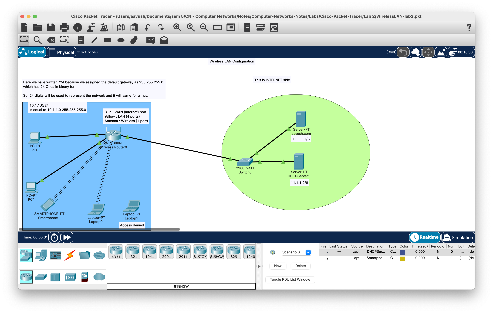

# LAB 2

[Watch Video Lecture](https://youtu.be/0zNQfxwtCsw)

- `WRT300N` is a linksys router by cisco.
	- Blue color port in actual model of this router is called WAN port.
	- Yellow color port is called as LAN port.
	> Internet port - Wide Area Network (WAN)
	> 1 Wireless port (antenna)
	> 4 Yellow Lan ports
	
- Any router can connect atleast 2 networks.
- In our wireless router, 
	- One network is from one wireless port
	- 4 Yellow ports are not represent 4 different networks.
	- These four ports can work like switch.
	- **SO here there are only 2 networks. wireless+WAN**

- for connecting LAN to Switch we use `Copper STRAIGHT through` wire.
- We have to connect pc to Ethernet port of router.

- ## Connecting Laptops to Wireless network
	- First, We have to switch off the laptop
	- Then remove the Ethernet card and drop it towards module menu.
	- Then insert `WPC300N` as wireless card.
	- Turn on the laptop.

- IP addresses will be assigned automatically to laptops
	- So router is working like a DHCP server
	
- Wireless Router Setup
	- Internet setup	*[Internet side port]*
		- In real life, Router are set to DHCP (Dynamic).
			- Static routers configurations are costly.
	- Network / LAN / LAN configuration setup	*[Other four LAN ports.]*
		- 4 Ethernet and 1 Wireless port will use this Network 's IP address.

- `*Default Gateway*` is the same as **IP ADDRESS of the router**.

- After updating the Settings or Configurations of Router, we have to manually update all connected devices by changing their network from DHCP to static and again set to DHCP to update their ip configurations.

- Here we have written /24 in First Wireless network. because we assigned the default gateway as 255.255.255.0 which has 24 Ones in binary form. So, 24 digits will be used to represent the network and it will same for all IPs.

- Changing no-password to password of Wireless router
	- Go to Router GUI
	- Go to Wireless/Basic Wireless settings
		- Network mode : keep it as `Mixed` to support all types of network
		- Network Name (SSID) : Name of Wifi.
		- Radio Band and Wide Channel should be set to `AUTO`.
		- Standard Channel : Recommended Channels out of 11 available channels are `1`, `6`, `11`.
		- SSID broadcast should be `Enable`. so that other  devices can discover this wireless network.
		- Save settings.
	
	- Now as soon as you update and save settings, all the  wireless devices should be disconnected.
	- If you didn't change the SSID of the network and keep it as `Default`, then all the  devices should be reconnected automatically.
	
	- After changing the SSID from `Default` to `NU_wifi` the devices will not re-connect automatically although we didn't set any password/security yet.
	- To connect to wireless network, we can use the on device application `PC Wireless`. and in that app, go to `Connect` and select `NU_wifi` then press connect. 
	- Now wireless network is connected.
	
	
	- There is no application named `PC Wireless` in mobile/smartphone. so for connecting that device to our wireless network,
		- Go to device/config/Wireless0 and then change its `SSID` from `Default` to `NU_Wifi`.
		- Then refresh the network by changing below `IP configuration` from DHCP to Static to Again `DHCP`.
		- Now smartphone should be connected to Wireless Network.
		
	
- Wireless Security
	- go to router/GUI/Wireless/Wireless Security
		- Do not select `WEP` as it is very weak.
		- We should select `WPA personal` or `WPA2 personal`. WPA2 is the strongest possible security.
		- Set key to `12344567890`.
		
	- Now all the wireless connected devices will be disconnected.
	- to reconnect, 
		- Laptops
			- Go to `PC wireless` again
			- connect to `NU_WiFi`. It will ask for password
			- Enter `12344567890` as password.
		- Smartphone
			- Go to Config/Wireless0
			- Enter SSID as `NU_WiFi`
			- Select Authentication type from `Disabled` to `WPA2-PSK`
				- PSK is short for "Pre-Shared Key."
			- Enter PSK Pass Phrase as `12344567890`.
	
- Set switch
	- connect switch to internet port of wireless router.
	- 
- Set 2  servers
	- Internet server
		- give this name as `aayush.com`.
		- set first server as internet server and connect it to switch
		- give ip address as `11.1.1.1/8`
		- Subnet mask : `255.0.0.0`
	- DHCP server
		- Turn on DHCP service.
		- give ip address as `11.1.1.2/8`
		- Subnet mask : `255.0.0.0`
		- Set DHCP services : 
			- Start ip address : `11.0.0.5`
			- Subnet mask : `255.0.0.0`
			- Maximum Numbers of users : `5`
			- Save settings.

- Refresh Wireless router
	- go to GUI/setup/basic setup
	- Change internet connection type from `auto` to `static` and again set to `Automatic Configuration - DHCP`.
	- Save settings.
	- Now see status option.

- `Status` in  Wireless router
	- To release the ip address , go to GUI/Status/
	- Click on IP address release
	- Click on IP address renew to again get new updated settings/ip-addresses.
	
- Make `aayush.com` to go to `11.1.1.1` via DNS server
	- Add `aayush.com` with address of Internet server as `11.1.1.1` to DNS service of DHCP server.
	- Setup DNS server to Wireless router
		- go to GUI/setup/basic setup
		- add Static DNS 1 : as `11.1.1.2` which is ip of DNS server provider (DHCP server). and save settings
		- Refresh devices to to get DNS address to all the devices which will be provided by Wireless router.
	- Now you can type `aayush.com` on any device's web browser to go to `11.1.1.1` page.
	
- Wireless MAC filter
	- From here, we can prevent specific device from accessing the network.
	- Lets deny access to `Laptop0`.
		- Go to GUI/Wireless/Wireless MAC filter
		- Enable it
		- Select `Prevent PCs listed below...`
		- Find MAC address of the device which you want to block access for.
			- Go to device's config/wireless0/Mac Address.
			- Here for `Laptop1` : MacAddress is : `00:10:11:7D:4A:2D`. *[originally it was `0010.117D.4A2D` but we have to do some formatting.]*
		- Copy Mac Address and paste in `MAC 01` field of MAC Address filter list of Wireless Mac Filter.
		- After saving, router will restart and two devices other `Laptop1` will reconnect to wireless network.
	- Similarly try the option `Permit the PCs listed below...`